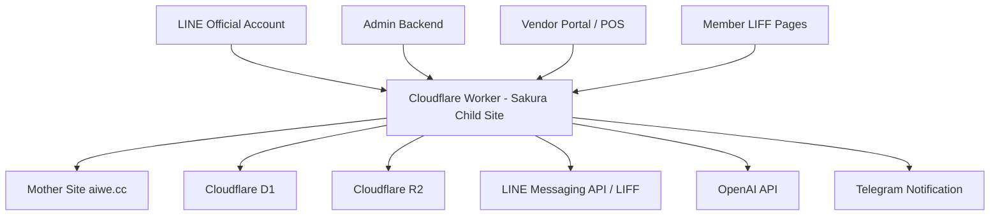

# ARCHITECTURE - Sakura Welfare Platform

## System Overview



## Main Runtime

- Runtime: Cloudflare Worker.
- Primary source file: `src/index.js`.
- Sakura deploy config: `wrangler.sakura-welfare.toml`.
- Database: Cloudflare D1 binding `DB`.
- File storage: Cloudflare R2 binding `R2_BUCKET`.
- Static and inline pages are currently served by Worker routes and embedded HTML constants.

## Mother Site

Mother site is the authority for:

- Employee verification.
- Employee roster and member master identity.
- LINE user binding status when owned by existing mother-site flows.
- Point insertion and query APIs.


After binding succeeds, the mother site should expose or return a clear binding result to the child site. The child site can then cache the result and operate Sakura-specific access, Rich Menu assignment, welfare pages, activity records, and redemption flows.

Known mother-site webhook:

- `https://aiwe.cc/index.php/line_login/9111/`

Known member binding route example:

- `https://aiwe.cc/index.php/wetw_employee_checkin/`

## Child Site

Child site is the authority for:


- Post-binding Sakura employee experience and Rich Menu assignment.
- Vendor registration and review.
- Vendor documents and R2 uploads.
- Vendor micro-site.
- Vendor POS redemption.
- Rich Menu project storage and deployment tooling.
- Keyword rules for child-site actions.
- Activity calendar and check-in records.
- Partner store and medical provider public pages.
- Admin dashboard, reports, and operational views.

## LINE OA / LIFF

Important principles:

- LINE OA has one official webhook URL. Worker acts as the ingress.
- `replyToken` ownership must be explicit. Mother-site functions must not be broken by child-site monitoring.
- LIFF is used where LINE identity, share target picker, or camera scanner is required.
- Vendor backend login is account/password first; LINE login is an auxiliary identity binding method only.

Current LIFF ID:

- `2009117474-pwyW1R4u`

## D1 Responsibility

D1 stores operational records for child-site features:


- Synchronized employee binding result used by Sakura workflows.
- Vendor applications and vendor review status.
- Vendor documents and uploaded file references.
- Rich Menu projects, deployed IDs, aliases, and switch diagnostics.
- POS redemption records.
- Activity events and check-in records.
- UID whitelist and admin permission records.
- Knowledge-base assets and AI support data.

## R2 Responsibility

R2 stores uploaded and generated files:

- Vendor documents.
- Vendor cover/logo/media images.
- Rich Menu images.
- OCR or AI-generated draft assets.
- Knowledge-base upload files.

R2 stores files. D1 stores metadata and review state.

## Telegram

Telegram is used for operational notification:

- Vendor application submitted.
- Vendor content modification request.
- Missing document or return-for-supplement events.
- High-risk LINE OA complaint or incident.

Telegram must not be treated as the source of truth.

## OpenAI / AI Functions

AI can assist with:

- OCR and document understanding.
- Vendor menu/DM content extraction in later phase.
- Translation drafts.
- LINE OA sentiment and issue classification.
- Suggested admin replies.
- Knowledge-base Q&A.

AI must not automatically approve vendor documents, employee benefits, or sensitive complaint responses.

## Deployment Rule

Use only:

```powershell
npx.cmd wrangler deploy -c wrangler.sakura-welfare.toml
```

Do not use bare `wrangler deploy` for Sakura production work.


