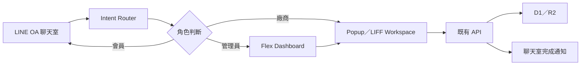
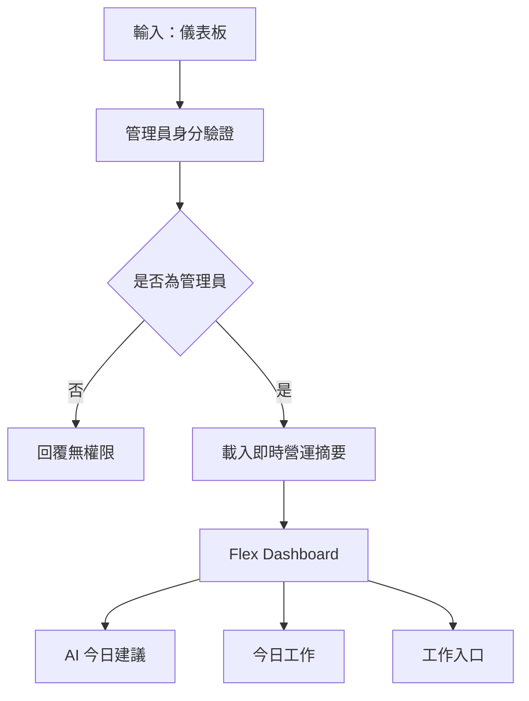
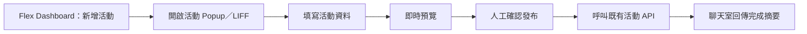
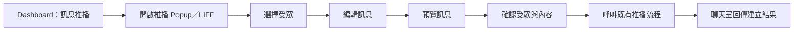
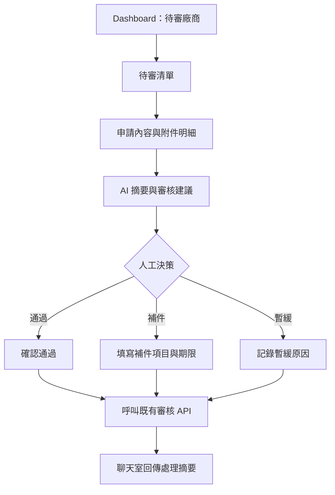
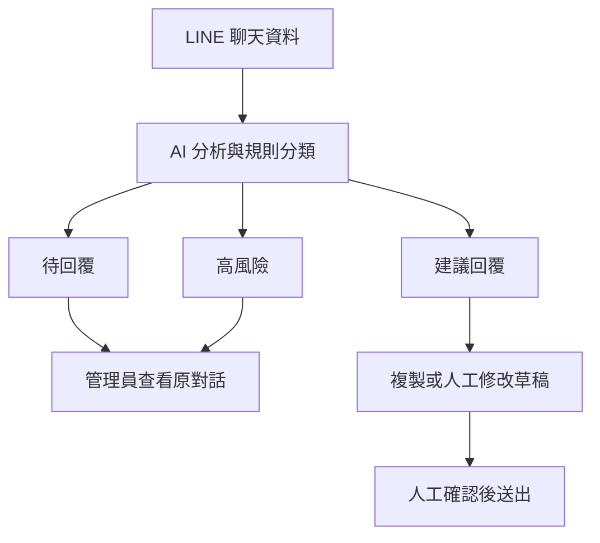
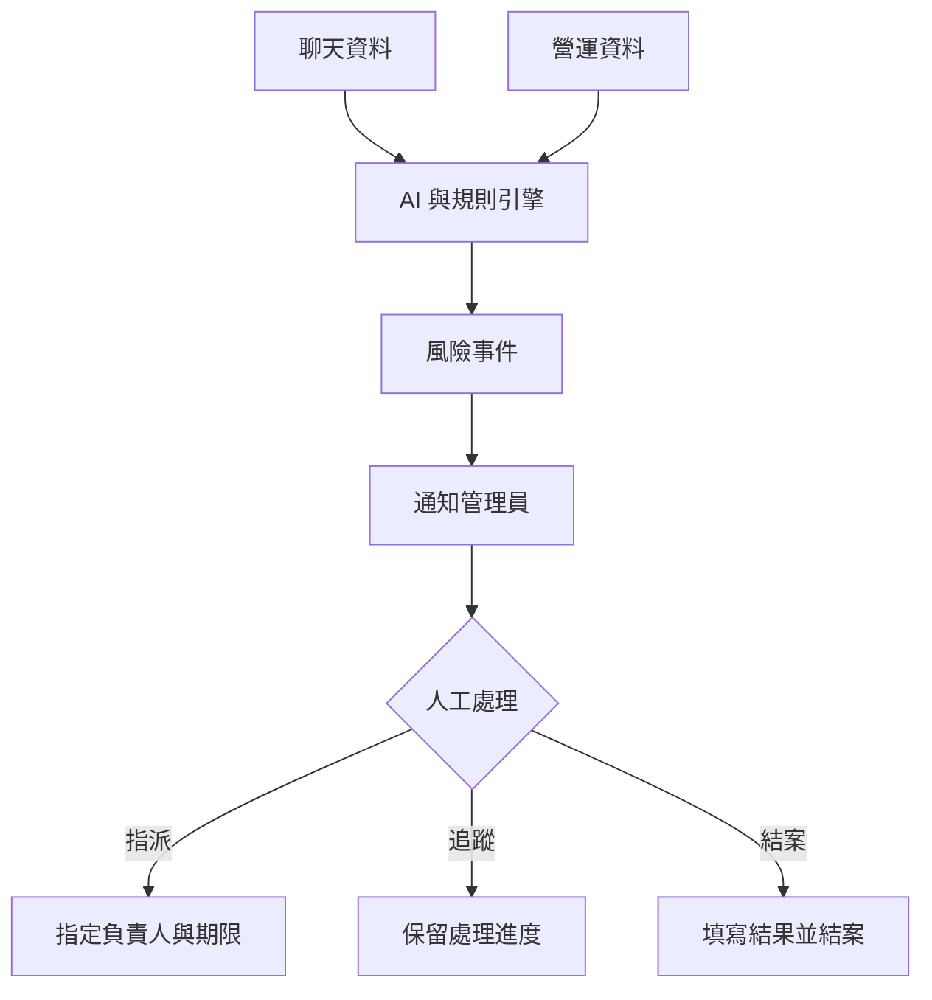

# 櫻花福委會 AI Workspace UX Flow

- 版本：V1.1
- 更新日期：2026-08-03
- 文件定位：目標 UX 與階段性實作依據

## 1. 設計理念

AI Workspace 並非一般聊天機器人，而是整個櫻花福委會的工作入口（Work Entry Point）。使用者不需要先理解完整後台架構，而是從熟悉的 LINE OA 聊天室提出需求，由系統判斷情境與角色，再進入相應的工作介面。

核心體驗：

> LINE 聊天室 → 情境判斷 → Flex Dashboard → Popup／LIFF Workspace → 完成工作 → 回聊天室確認

> 現況說明：Phase 1 目前以精準關鍵字、管理員白名單及唯讀文字摘要運作。Flex Dashboard、Popup／LIFF Workspace 與後續寫入工作屬目標 UX，未完成前不得標示為已上線。

## 2. 儀表板流程

Dashboard 顯示：

- 待審廠商數。
- 已上架優惠數。
- 今日核銷筆數。
- 今日核銷金額。
- 待回覆聊天室數。
- AI 今日建議。
- 今日工作。
- 各功能工作入口。

儀表板預設為唯讀。使用者點擊工作入口後，才進入對應的 Popup、LIFF 或下一層 Flex。

## 3. 新增活動

活動欄位：

- 標題。
- 所屬社團。
- 活動圖片。
- 日期與時間。
- 地點。
- 活動內容。
- QR 報到設定。
- 報名資格、名額與期間。

安全要求：草稿與正式發布必須明確區分；正式發布前須顯示影響範圍並再次確認。

## 4. 訊息推播

受眾條件：

- 全體。
- 部門。
- 系統標籤。
- 活動參加者。
- 自訂條件。

推播不得由 AI 自動送出。確認畫面必須顯示預估人數、受眾條件、訊息內容、發送時間與費用或額度風險。

## 5. 廠商審核

AI 只能整理申請內容、指出缺件與提供建議，不能自行核准、退回或停權廠商。

## 6. 聊天室監控

監控介面需保留真人名稱、頭像、訊息時間、角色、標籤及完整互動紀錄。AI 建議預設只供參考，不自動回覆。

## 7. AI 風險中心

監控範圍：

- 廠商抱怨與服務品質問題。
- 活動報名、名額或報到異常。
- 點數與身分爭議。
- 核銷金額、重複核銷與異常頻率。
- API、Webhook、D1、R2、LIFF 與 LINE Bot 異常。

## 8. Popup／LIFF Workspace 原則

所有需要填表或確認的工作應遵守下列原則：

- 優先維持 LINE 使用情境，不要求使用者理解後台路徑。
- 以 LIFF 或 Popup 開啟，桌面版需有 Web fallback。
- 所見即所得，重要內容即時預覽。
- 顯示讀取中、部分成功、成功與失敗狀態。
- 完成後回到聊天室，提供清楚的結果摘要與下一步。
- 表單重整、連點或網路重送不得造成重複寫入。
- 權限、角色與資料範圍必須由後端重新驗證，不能只信任前端參數。

## 9. AI 工作原則

AI 可以主動：

- 整理今日工作。
- 提醒風險。
- 建議下一步。
- 摘要聊天室與申請內容。
- 協助產生草稿、分類與欄位建議。

AI 不得主動：

- 發送正式推播。
- 通過、退回或停權廠商。
- 贈點、扣點或修改點數。
- 刪除正式資料。
- 代表管理員完成高風險決策。

所有高風險操作均需人工確認，並留下可追溯的操作紀錄。

## 10. UX 成功指標

- 使用者不需要先學會完整後台，即可完成主要日常工作。
- 80% 日常管理工作可從 LINE 聊天室發起並完成。
- Flex Dashboard 成為主要工作入口。
- Popup／LIFF Workspace 成為主要操作介面。
- AI 主動提示優先工作與風險，而不是等待使用者搜尋功能。
- 任何工作完成後，聊天室都有明確、可理解且可追溯的結果通知。
