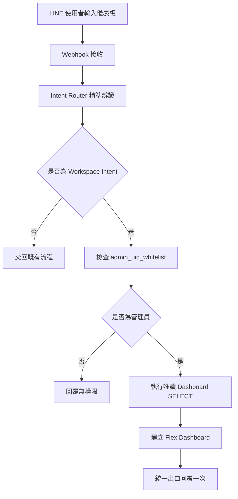

# 櫻花福委會 AI Workspace V1 規格

- 版本：V1.0
- 狀態：開發與驗收依據
- 更新日期：2026-08-03

> **現行基線**：已有精準關鍵字、管理員白名單、唯讀 D1 查詢、Flex Dashboard V2、固定今日待辦與五個安全 placeholder 入口。
>
> **V1 完成目標**：管理員輸入 `儀表板` 或 `仪表板` 後，取得 Flex Dashboard 與五個安全工作入口。五個入口目前只回覆 `此功能即將開放`，尚未提供 Popup、資料寫入或正式工作流程。

## 1. 文件目的

本文件定義「櫻花福委會 AI Workspace V1」的功能、互動、權限、測試、驗收、部署與回滾要求。V1 不重做後台，而是在既有 LINE OA、雙 Webhook、D1 與管理權限架構上，增加 LINE OA 管理工作入口。

## 2. V1 產品目標

管理員在 LINE OA 輸入 `儀表板` 或 `仪表板` 時，系統必須先驗證 LINE `userId`，再讀取正式 D1 數據並回傳 Flex Message。Flex 上半部顯示營運摘要與待辦，下半部提供：新增活動、訊息推播、廠商審核、風險中心、聊天室監控。

V1 僅 SELECT，不寫入業務資料、不新增 migration、不修改 Admin UI、不改變母站員工身分與點數權威，也不破壞單一 replyToken 回覆責任。

## 3. V1 範圍

### 必須完成

- 精準關鍵字辨識與管理員驗證。
- 即時儀表板查詢與 Flex Dashboard。
- 五個可點擊且有明確結果的工作入口。
- 非管理員拒絕、局部容錯、自動測試。
- LINE OA 驗收、部署與回滾說明。

### 可使用安全 Placeholder

五個入口可回覆「功能建置中」、導向既有有效頁面或可用 LIFF 測試頁；不得無反應、導向不存在網址或直接執行高風險寫入。

### 本次不做

正式建立／發布活動、正式推播、核准／退件廠商、AI 自動處分或回覆、點數與核銷異動、刪除資料、新資料表、migration、多租戶重構及重做後台。

## 4. 使用角色

- **管理員**：來源為啟用中的 `admin_uid_whitelist`，可讀取營運摘要、待辦與工作入口。
- **非管理員**：一般員工、廠商、訪客、未綁定者及非白名單使用者。只能收到無權限訊息，不得執行管理統計查詢或得知管理資料。

## 5. 關鍵字規格

只接受 `儀表板`、`仪表板`。前處理可去除前後空白與換行並正規化全形／半形空白，不做模糊比對。

| 輸入 | 觸發 |
| --- | --- |
| `儀表板`、`仪表板`、` 儀表板 ` | 是 |
| `請開啟儀表板`、`我要看儀表板`、`dashboard` | 否 |

## 6. 主流程



## 7. 權限流程

固定順序：辨識 Intent → 驗證管理員 → 查詢統計 → 建立 Flex → 統一回覆。禁止先查詢再驗證。白名單須支援多個 `userId`、去除空白、拒絕空值，且不得把完整白名單寫入 log。

```js
async function isAdminUser(env, userId) {
  // Read enabled identity from admin_uid_whitelist.
}
```

## 8. 儀表板資料規格

| 指標 | 正式定義 | 無資料／未啟用 |
| --- | --- | --- |
| 待審廠商 | 待審狀態；排除通過、退件、草稿、隱藏 | `0` |
| 上架優惠 | 已核准且有效；排除下架、過期、草稿 | `0` |
| 今日核銷筆數 | `Asia/Taipei` 當日成功核銷 | `0` |
| 今日核銷金額 | 同一核銷範圍的實付合計 | `NT$0` |
| 風險事件 | 使用既有正式資料 | 未啟用或 `0`，不得捏造 |
| 待處理聊天室 | 使用既有未處理訊息 | 未啟用或 `0` |

各指標須獨立容錯；單一指標失敗不得使整張儀表板無回覆。

## 9. Flex Dashboard 視覺規格

1. Header：櫻花福委會 AI 工作台、今日營運摘要、台北更新時間。
2. 營運摘要：待審廠商、上架優惠、今日核銷筆數與金額，採兩欄排列。
3. 今日待辦：只列有資料項目；無待辦顯示「目前沒有急需處理的事項」。
4. 工作入口：五個有文字標籤的按鈕。

| 按鈕 | Action |
| --- | --- |
| 新增活動 | `workspace.activity.create` |
| 訊息推播 | `workspace.push.create` |
| 廠商審核 | `workspace.vendor.review` |
| 風險中心 | `workspace.risk.list` |
| 聊天室監控 | `workspace.chat.monitor` |

優先使用 postback；需要開啟既有頁面時才使用 URI。

## 10. Flex Message 格式

```js
{
  type: "flex",
  altText: "櫻花福委會 AI 工作台",
  contents: { type: "bubble", header: {}, body: {}, footer: {} }
}
```

`altText` 必須有意義，例如：`櫻花福委會 AI 工作台：待審廠商 3 家、今日核銷 12 筆。`

## 11. 五個入口規格

### 新增活動

V1 導向既有有效活動頁，或回覆工作台建置中；不得直接建立或發布活動。未來欄位含類型、社團、標題、圖片、日期時間、地點、名額、報名起訖、資格、QR 報到與發布狀態。

### 訊息推播

V1 導向既有分眾推播頁或回覆建置中；不得立即發送。未來流程：選受眾 → 預估人數 → 編輯 → 預覽 → 測試發送 → 二次確認 → 發送／排程。

### 廠商審核

V1 顯示待審摘要／清單或導向既有廠商管理頁；不得直接核准、退件或停權。

### 風險中心

V1 顯示既有異常摘要；無正式資料源時顯示建置中。AI 不得自動處分。

### 聊天室監控

V1 顯示未處理摘要或導向既有監控頁，不得替管理員自動送出 AI 回覆。

## 12. Workspace Response 標準

Handler 回傳中立結構，不直接耦合 LINE SDK：

```js
{
  ok: true,
  responseType: "flex",
  intent: "workspace.dashboard",
  altText: "櫻花福委會 AI 工作台",
  payload: {},
  metadata: { readOnly: true, adminOnly: true }
}
```

錯誤格式：

```js
{
  ok: false,
  code: "DASHBOARD_QUERY_FAILED",
  message: "目前無法取得完整營運摘要",
  retryable: true
}
```

## 13. 錯誤處理

- 管理員設定缺失：回覆「管理員權限設定尚未完成，請聯絡系統管理者。」不得預設放行。
- 統計局部失敗：顯示其餘指標與工作入口，失敗項目標示暫時無法取得。
- Flex 組裝失敗：回覆純文字 fallback，不得無回應。
- LINE reply 失敗：記錄 request ID；不得重複使用 replyToken、無限重試或記錄 token。

## 14. Webhook 單一回覆規則

- 保留母站／子站雙 Webhook 邊界與單一 reply owner。
- 一個 replyToken 最多使用一次，由統一出口送出。
- Workspace 接手後母站不得再次回覆；非 Workspace Intent 交回既有流程。
- 不得影響員工驗證、會員綁定、點數讀寫、廠商專區、既有關鍵字與 Rich Menu。

## 15. 建議檔案結構

```text
src/workspace/
  intent-router.js
  workspace-router.js
  permission-manager.js
  response-builder.js
  dashboard/
    dashboard-handler.js
    dashboard-service.js
    dashboard-flex.js
  placeholders/
    activity-placeholder.js
    push-placeholder.js
    vendor-review-placeholder.js
    risk-placeholder.js
    chat-monitor-placeholder.js
```

現有 `src/workspace/intent-router.js` 與 `src/workspace/dashboard-handler.js` 可延續；不得建立第二套平行 Workspace。

## 16. 測試規格

| 測試 | 預期 |
| --- | --- |
| 管理員輸入繁／簡關鍵字 | 驗證、SELECT、Flex、五入口、不寫入 |
| 非管理員輸入關鍵字 | 無權限且不執行管理 SQL |
| 輸入 `廠商專區` | 交回既有流程 |
| 單一指標失敗 | 有可理解回覆，不造成 Worker 500 |
| Flex schema | 有 `altText`、合法 bubble、五個 action 正確 |
| replyToken | 同一事件只回覆一次 |
| 唯讀邊界 | Workspace 無 INSERT、UPDATE、DELETE |

建議指令：

```powershell
npm.cmd run test:workspace
node --check src\index.js
```

## 17. 驗收標準

- **管理員**：輸入 `儀表板` 後看到 Flex、標題、即時摘要、今日待辦與五個可點入口，不得只有純文字。
- **非管理員**：只看到無權限；後端不得執行管理統計查詢。
- **回歸**：員工綁定、母站會員、點數讀寫、廠商專區、Rich Menu、活動、Webhook 及其他關鍵字維持原行為。

## 18. 部署規格

```powershell
cd "D:\OneDrive\文件\New project 5"
npm.cmd ci
npm.cmd run check:welfare
npm.cmd run predeploy:welfare
node --check src\index.js
```

正式部署只能使用：

```powershell
npm.cmd run deploy:welfare
```

或：

```powershell
npx.cmd wrangler deploy -c "D:\OneDrive\文件\New project 5\wrangler.sakura-welfare.toml"
```

不得使用裸指令 `wrangler deploy`。

## 19. 回滾規格

交付時記錄部署前後 commit、Cloudflare Worker 前一版本及回滾步驟。若儀表板無回覆、既有流程失效、非管理員取得資料、replyToken 重複、Worker 500 增加或 Flex 格式錯誤，應立即回滾。

## 20. Codex 實作任務

1. 延續既有 Workspace，不建立第二套實作。
2. 支援繁簡精準關鍵字。
3. 查詢待審廠商、上架優惠、今日核銷筆數與金額。
4. 提供五個安全工作入口。
5. 非管理員先拒絕且不查管理資料。
6. 僅 SELECT，不新增 migration，不修改 Admin UI。
7. 維持單一 reply owner 與母站權威。
8. 完成測試、LINE OA 驗收與回滾說明後才能標示完成。

交付報告須列：功能摘要、檔案、風險、測試、部署狀態與指令、回滾、管理員／非管理員驗收、回歸結果、Webhook 影響、資料寫入及 migration 狀態。

## 21. 完成定義

只有程式與測試完成、Flex 儀表板達標、五入口可用、權限正確、無業務寫入與 migration、不影響既有功能、具備部署／回滾／LINE OA 驗收步驟，且明確標示部署狀態時，才可將 V1 標示為完成。
