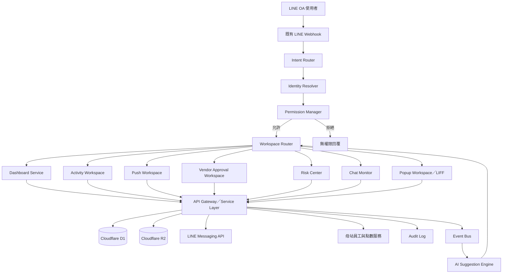
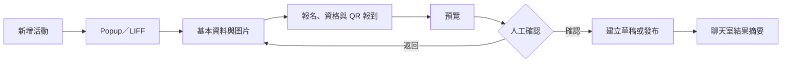

# 櫻花福委會 AI Workspace Architecture

- 文件名稱：AI Workspace Architecture
- 專案名稱：櫻花福委會福利資訊整合平台
- 文件版本：V1.0
- 文件日期：2026-08-03
- 文件性質：目標架構與模組責任

## 1. 文件目的

本文件定義「櫻花福委會 AI Workspace」的技術架構、模組責任、安全邊界與分階段交付方式。

核心原則：

1. 不重寫既有櫻花福委會後台。
2. 不破壞既有 LINE Webhook 單一回覆責任。
3. 將 AI 作為管理工作的入口與協作層，不作為未授權決策者。
4. 優先把複雜後台工作轉成前台可理解、可操作的流程。
5. 第一階段以只讀、低風險功能為主。
6. 所有資料寫入、核准、推播與高風險動作，都必須經過權限驗證與人工確認。
7. 架構可被其他專案複用，但本專案不以 SaaS 化為交付前提。

## 2. 現況與目標界線

### 2.1 目前已完成的 Phase 1

- 管理員在 LINE OA 輸入精準關鍵字「儀表板」。
- 系統以 `admin_uid_whitelist` 驗證管理員身分。
- 呼叫既有 Dashboard Summary 查詢能力。
- 回覆唯讀文字摘要。
- 不新增 Workspace 業務資料寫入。
- 不改 Admin UI、資料表、母站權威或既有 replyToken 擁有者。

### 2.2 Phase 1.1 目標

- 將唯讀文字摘要升級為 Flex Dashboard。
- 顯示今日待辦、即時營運摘要與五個 Workspace 入口。
- 按鈕先導向唯讀摘要、既有頁面或安全 placeholder。
- 仍維持無 migration、無 Workspace 業務寫入及無高風險自動操作。

> 本文件後續描述的是完整目標架構。除非另有「已完成」標記，不代表功能已經上線。

## 3. 系統定位

AI Workspace 不是單純聊天機器人，也不是傳統後台的替代品。它是位於 LINE OA、既有後台與業務 API 之間的工作協作層，負責：

- 辨識使用者身分與權限。
- 理解使用者想完成的工作。
- 顯示即時營運摘要與待辦事項。
- 將複雜工作引導成簡單步驟。
- 開啟 Popup Workspace 或既有 LIFF 工作頁面。
- 經由既有服務或 API 完成查詢與受控操作。
- 將執行結果回傳到 LINE 聊天室。
- 對高風險動作建立確認與稽核紀錄。

## 4. 整體架構



## 5. 架構分層

### 5.1 Channel Layer

包含 LINE Messaging API、LINE OA Webhook、Flex Message、LIFF、Popup Workspace，以及未來可能加入的 Web Admin AI Assistant。

責任：

- 接收文字、按鈕事件與 postback。
- 將請求交給 Intent Router。
- 維持 LINE replyToken 單一回覆責任。
- 將標準 Workspace Response 轉為 LINE 可接受的訊息格式。
- 不直接執行業務邏輯或資料寫入。

### 5.2 Intent Router

第一階段採用明確關鍵字與 postback action，不依賴大型語言模型推測意圖。

初期意圖：

- `workspace.dashboard`
- `workspace.activity.create`
- `workspace.push.create`
- `workspace.vendor.review`
- `workspace.risk.list`
- `workspace.chat.monitor`

建議介面：

```js
routeIntent({ text, postbackData, userId, sourceType })
```

標準結果：

```json
{
  "intent": "workspace.dashboard",
  "confidence": 1,
  "params": {},
  "source": "keyword"
}
```

規則：

- 關鍵字集中管理，不散落在 `src/index.js`。
- Intent 不直接呼叫資料庫。
- 無法辨識時回傳安全導覽，不猜測高風險操作。
- 母站既有關鍵字優先權不得被 Workspace 攔截。

### 5.3 Identity Resolver

可能身分來源：

- LINE userId。
- `admin_uid_whitelist`。
- 廠商帳號及 LINE 綁定。
- 母站員工驗證同步結果。
- 子站 CRM／會員資料。
- LIFF 或 Workspace session。

標準身分：

```json
{
  "userId": "Uxxxxxxxx",
  "role": "admin",
  "vendorId": null,
  "employeeId": null,
  "locale": "zh-TW",
  "authenticated": true
}
```

角色：`admin`、`operator`、`vendor`、`employee`、`anonymous`。

原則：

- 身分辨識與權限判斷分開。
- 知道 userId 不等於具有管理權限。
- 廠商只能存取自己的資源。
- 員工只能存取員工福利與個人紀錄。
- 非管理角色不得取得管理摘要。

### 5.4 Permission Manager

採 RBAC 加上資源範圍限制。所有寫入動作都必須由後端授權，不能只靠前端隱藏按鈕。

| Action | Admin | Operator | Vendor | Employee |
| --- | --- | --- | --- | --- |
| `workspace.dashboard.read` | 允許 | 依設定 | 拒絕 | 拒絕 |
| `vendor.approval.read` | 允許 | 依設定 | 拒絕 | 拒絕 |
| `vendor.approval.write` | 允許 | 依設定 | 拒絕 | 拒絕 |
| `activity.create` | 允許 | 依設定 | 依設定 | 拒絕 |
| `push.preview` | 允許 | 依設定 | 拒絕 | 拒絕 |
| `push.send` | 允許並確認 | 依設定並確認 | 拒絕 | 拒絕 |
| `vendor.profile.update` | 允許 | 允許 | 僅自己 | 拒絕 |
| `employee.points.read` | 依需求 | 拒絕 | 拒絕 | 僅自己 |

建議介面：

```js
authorize({ identity, action, resource })
```

### 5.5 Workspace Router

Workspace Router 接收標準化 intent 與授權結果，再交給單一 handler。

```js
const workspaceHandlers = {
  "workspace.dashboard": handleDashboard,
  "workspace.activity.create": handleActivityCreate,
  "workspace.push.create": handlePushCreate,
  "workspace.vendor.review": handleVendorReview,
  "workspace.risk.list": handleRiskCenter,
  "workspace.chat.monitor": handleChatMonitor
};
```

標準回傳：

```json
{
  "type": "flex",
  "title": "營運儀表板",
  "data": {},
  "actions": [],
  "fallbackText": "今日營運摘要"
}
```

Router 不直接組合 LINE SDK 細節，也不直接操作 D1。

### 5.6 Dashboard Service

目標資料：

- 待審廠商數。
- 已上架優惠數。
- 今日核銷筆數與金額。
- 待處理風險事件數。
- 待處理聊天室訊息數。
- 即將開始或截止的活動數。

工作入口：新增活動、訊息推播、廠商審核、風險中心、聊天室監控。

規則：

- 優先顯示今天該處理的工作。
- 保留舊版 Flex 儀表板資訊密度。
- 單一資料來源失敗時顯示局部錯誤，不使整張卡片失效。
- Phase 1／1.1 僅執行 SELECT。

### 5.7 Popup Workspace／LIFF

需要填表、上傳圖片、選日期或預覽內容時，使用 Flex 按鈕開啟 LIFF／Popup，不把複雜表單塞進聊天室。

共用能力：

- 驗證 session 與角色。
- 欄位驗證。
- 草稿儲存。
- 圖片上傳至 R2。
- 所見即所得預覽。
- 送出前確認。
- 成功後回傳結果。
- 失敗時顯示可重試原因。

## 6. Workspace 模組

### 6.1 新增活動 Workspace

支援社團、課程、講座、福委會活動、報名及 QR 報到活動。AI 可協助整理文案與檢查欄位，但不得自行正式發布。



### 6.2 訊息推播 Workspace

支援分眾推播、活動通知、優惠通知、提醒、公告與排程。

安全要求：

- 顯示預估受眾數。
- AI 不得自行決定受眾。
- 正式發送前二次確認。
- 大量推播顯示風險提示。
- 先支援測試發送，再開放正式發送。
- 發送結果寫入 Audit Log。

### 6.3 廠商審核 Workspace

顯示廠商、聯絡人、統編、店家與優惠、文件、補件紀錄、風險提示與狀態。AI 只能摘要與標示缺漏，管理員負責通過、退件或要求補件。

### 6.4 風險中心

彙整廠商抱怨、負面訊息、核銷異常、活動爭議、點數爭議、Webhook／API 異常、推播失敗及資料過期等事件。

AI 可摘要、分類、排序、找相關紀錄及建議處理方式；不得自動停權、刪除、退款、公開回覆或判定責任。

### 6.5 聊天室監控

提供未處理、高優先、負面情緒、需人工回覆的對話與建議回覆。AI 建議必須顯示依據並由管理員確認；退款、法律、個資與爭議一律轉人工。

## 7. API Gateway／Service Layer

Workspace 不應散落呼叫 D1、R2、LINE API 或母站服務。共用 Service Layer 負責：

- 參數驗證。
- 權限再檢查。
- timeout 與 retry 規則。
- 標準錯誤格式。
- Audit Log。
- 隱藏底層服務細節。

```json
{
  "ok": false,
  "code": "PERMISSION_DENIED",
  "message": "您沒有權限執行此操作",
  "retryable": false
}
```

## 8. Event Bus 與 AI Suggestion Engine

事件來源可包含新廠商申請、補件、活動期限、抱怨、推播完成或失敗、核銷異常及服務錯誤。

第一階段不建立完整訊息佇列，可先使用既有 D1 資料聚合、service-level event function 與排程查詢；流量或可靠性需求明確後再評估 Cloudflare Queues。

AI 僅負責摘要、分類、建議、排序、草稿、問題釐清及結構化指令草稿。AI 不得繞過 Permission Manager、Workspace Router、API Gateway、人工確認或 Audit Log。

高風險流程固定為：

> AI 建議 → 顯示執行內容 → 人工確認 → 權限再驗證 → 執行 → 稽核紀錄

## 9. Audit Log

管理操作至少記錄：

- 操作者、LINE userId 與角色。
- Action、Resource 與 requestId。
- 原始輸入與執行參數。
- 是否由 AI 建議。
- 是否經人工確認。
- 執行結果、時間與錯誤資訊。

Phase 1／1.1 不為 Workspace 新增資料表；正式進入寫入型階段前，必須先確認可沿用的既有稽核結構或提出獨立 migration 計畫。

## 10. Webhook 單一回覆責任

本專案已有母站與子站雙 Webhook。AI Workspace 必須遵守：

1. replyToken 只能由一個流程使用。
2. Intent Router 在既有路由責任內執行。
3. 母站與子站不得同時回覆同一事件。
4. 背景監控、資料寫入與轉發使用 `ctx.waitUntil()`，不得阻塞主要回覆。
5. 多步工作優先採 LIFF／Popup；後續通知需符合 LINE 訊息費用與權限策略。
6. 無法確認責任歸屬時，Workspace 不回覆，交回既有路由。
7. 所有新增功能都要驗證不影響員工、會員、點數與母站關鍵字。

## 11. 建議程式結構

```text
src/
  workspace/
    intent-router.js
    workspace-router.js
    identity-resolver.js
    permission-manager.js
    response-builder.js
    dashboard/
      dashboard-handler.js
      dashboard-service.js
      dashboard-flex.js
    activity/
      activity-handler.js
      activity-service.js
      activity-validator.js
    push/
      push-handler.js
      push-service.js
      push-validator.js
    vendor-review/
      vendor-review-handler.js
      vendor-review-service.js
    risk/
      risk-handler.js
      risk-service.js
      risk-classifier.js
    chat-monitor/
      chat-monitor-handler.js
      chat-monitor-service.js
      reply-suggestion-service.js
    shared/
      api-gateway.js
      audit-log.js
      event-bus.js
      errors.js
      constants.js
```

`src/index.js` 只保留 Webhook 入口、既有主路由、Workspace 委派、統一錯誤處理及單一回覆責任。不得把 Workspace 業務邏輯重新集中塞回 `src/index.js`。

## 12. 風險與部署策略

| 等級 | 功能 | 必要控制 |
| --- | --- | --- |
| 低風險 | 儀表板、待辦、唯讀報表、聊天室摘要 | 僅 SELECT、無 migration、無點數／核銷／推播寫入 |
| 中風險 | 活動草稿、廠商資料更新、推播草稿或排程 | 權限測試、Audit Log、可逆狀態、回滾與驗收 |
| 高風險 | 正式推播、點數、核銷、停權、刪除、正式發布 | 二次確認、人工審核、受限測試、補償機制與完整稽核 |

任何高風險操作都不得由 AI 自動執行。

## 13. 分階段交付

### Phase 1：已完成基線

- 精準關鍵字「儀表板」。
- 管理員白名單。
- Dashboard Summary 唯讀文字摘要。
- 無 Workspace 業務寫入、migration 或 Admin UI 變更。

### Phase 1.1：Flex Dashboard

- 完整 Flex Dashboard。
- 即時摘要與五個入口。
- 管理員可見、非管理員拒絕。
- 保留單一 replyToken 與既有 Webhook 流程。

### Phase 2：活動 Workspace

- 活動草稿、圖片上傳、預覽與聊天室摘要。

### Phase 3：分眾推播 Workspace

- 受眾預估、測試發送、排程、二次確認與 Audit Log。

### Phase 4：廠商審核 Workspace

- AI 缺漏摘要、人工核准／退件、補件流程與稽核。

### Phase 5：風險中心與聊天室監控

- 事件聚合、優先級、AI 草稿與人工處理。

## 14. Codex 交付標準

每次 AI Workspace 任務應回報：

- 功能摘要。
- 修改及新增檔案。
- 風險等級與影響範圍。
- 權限規則。
- 實際測試結果。
- 是否部署、目標與指令。
- 回滾方式與驗收步驟。
- 管理員與非管理員預期結果。
- 是否影響既有 Webhook。
- 是否包含資料寫入、migration 或人工確認。

沒有完整驗收證據，不得標示為完成。

## 15. 架構決策摘要

- 既有後台保留。
- LINE OA 是主要工作入口之一。
- Flex Dashboard 是目標管理首頁。
- Popup／LIFF 負責複雜輸入。
- 母站仍掌管員工驗證與點數；子站掌管廠商、福利、活動、核銷與營運。
- AI 負責建議與整理，不負責未授權決策。
- 所有寫入都經過權限、確認與稽核。
- Phase 1／1.1 維持只讀。
- 不為 SaaS 化而重構櫻花福委會。
- 模組可複用，但交付仍以櫻花福委會為主。
