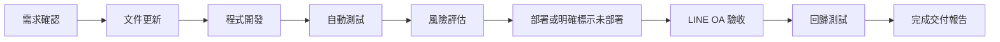

# AI Workspace Delivery Standard

## 1. 文件目的

本文件定義「櫻花福委會 AI Workspace」所有開發工作的交付標準（Delivery Standard）。

所有由 Codex、AI Agent 或人工完成的功能，都必須依照本文件進行開發、驗證與回報。未符合本文件要求，不得標示為「已完成交付」。

本標準適用於：

- LINE OA 與雙 Webhook 流程
- AI Workspace 與管理員聊天室入口
- LIFF、LINE Login 與身分權限
- Admin UI、廠商專區與會員功能
- D1、R2、母站 API 與子站 Service Layer
- 活動、推播、Rich Menu、核銷與監控功能
- 文件、測試、部署及回滾作業

## 2. 交付流程

每一次開發皆遵循以下流程：



任何階段失敗，必須停止向下一階段宣稱完成，並回報失敗原因、影響範圍與後續處理方式。

## 3. 交付狀態

每次回報必須使用以下其中一種狀態：

| 狀態 | 定義 |
| --- | --- |
| 開發中 | 功能、文件或測試尚未完成。 |
| 開發完成，尚未完成交付 | 程式已完成，但缺少測試、部署、LINE OA 驗收、回歸測試、回滾資訊或已知限制揭露。 |
| 已部署，待驗收 | 已部署至指定環境，但尚未完成管理員、非管理員或 LINE OA 實機驗收。 |
| 已完成交付 | 功能、文件、測試、部署狀態、驗收、回滾與已知限制均已完整記錄。 |

文件工作若不涉及執行程式，可在完成文件檢查後標示「已完成交付」，但部署狀態必須明確寫為「未部署／不適用」，不得省略。

## 4. 每次交付必須包含

### A. 功能摘要

- 本次完成目標
- 解決的問題
- 實際行為變更
- 未完成事項

### B. 修改內容

- 修改檔案
- 新增檔案
- 刪除檔案（如有）
- 資料表或 migration（如有）

### C. 影響分析

必須逐項回答「是／否／不適用」，並說明原因：

- 是否影響 Webhook
- 是否改變 LINE reply owner 或 replyToken 使用方式
- 是否影響 LINE Login／LIFF redirect
- 是否影響 Admin UI
- 是否影響 D1
- 是否影響 R2
- 是否影響母站 API、員工身分或點數
- 是否影響權限、Session、Secret 或 Binding

母站仍負責員工身分與點數；子站不得在未經明確核准下建立第二套權威資料。LINE 回覆責任必須維持單一 owner，避免重複消耗 replyToken。

### D. 風險等級

| 等級 | 判定參考 |
| --- | --- |
| Low | 文件、文案、局部樣式或不改變資料與權限的窄幅修正。 |
| Medium | 既有 API、流程、查詢、LIFF、Rich Menu 或 UI 互動行為變更，但有明確邊界與回歸測試。 |
| High | Webhook、身分權限、母站同步、點數、核銷、推播、資料寫入、migration、Secret、Binding 或不可逆操作。 |

風險報告必須說明判定原因與降低風險的措施。

## 5. 測試報告

至少提供：

- 語法檢查
- Unit Test
- Integration Test（如有）
- `check` 結果
- `predeploy` 結果
- 路由或 LINE OA 實際行為驗證

每個測試項目應記錄：執行指令、結果（PASS／FAIL／未執行）、關鍵輸出或失敗原因，以及測試環境。

Worker 程式碼的最低檢查：

```powershell
node --check src\index.js
npm.cmd run predeploy:welfare
```

若專案存在對應測試，必須執行，不可只以語法檢查代替。若未執行任何要求的測試，必須說明原因，且不得標示為「已完成交付」。不得以舊測試結果、推測或畫面看似正常取代本次驗證證據。

## 6. 部署狀態

交付報告必須明確標示：

- 已部署或未部署
- 部署環境
- Worker 名稱
- 部署時間
- Cloudflare Version ID（已部署時）
- 部署指令

櫻花 Worker 的標準部署指令：

```powershell
cd "D:\OneDrive\文件\New project 5"
npx.cmd wrangler deploy -c wrangler.sakura-welfare.toml
```

不得使用未指定設定檔的裸指令 `wrangler deploy`。不得把「程式已寫好」描述為「已部署」。

未部署時，必須寫明未部署原因、尚需執行的步驟，以及是否包含 migration、Remote D1 write 或 Secret／Binding 變更。

## 7. 回滾方式

每次程式或正式環境交付必須提供：

- 前一個可用版本的 Git commit 或 Cloudflare Version ID
- 回滾步驟與指令（如適用）
- 回滾條件
- 回滾後驗證項目

不得虛構前一版本或 Version ID。若本次未部署，應寫明「不需執行環境回滾」，並說明如何撤銷本次檔案修改。

建議回滾條件包括：

- LINE Webhook 無法接收或重複回覆
- LINE Login／LIFF 發生登入循環或 redirect 錯誤
- 權限外洩或非管理員可讀取管理資料
- D1 寫入錯誤、資料遺失或重複交易
- 核銷、點數或推播出現錯誤
- 主要管理頁無法操作

## 8. 驗收流程

### 管理員驗收

逐步列出：

1. 從哪個入口操作。
2. 要輸入、點擊或掃描什麼。
3. 預期看到的畫面或 Flex Message。
4. 預期 API、資料與聊天室結果。
5. 如何確認沒有重複寫入或未授權操作。

### 非管理員驗收

逐步列出：

1. 使用哪一種非管理員身分。
2. 執行相同或受限操作。
3. 預期收到的拒絕、隱藏或引導結果。
4. 確認管理資料未外洩、未寫入、未觸發高風險操作。

若功能只供特定角色使用，仍必須完成非授權角色的負向測試。

## 9. 回歸測試

每次交付需依影響範圍確認以下功能未受影響：

- 員工登入與母站綁定
- 點數讀寫
- 廠商申請、審核與廠商專區
- Rich Menu 專案、部署、切換與身分綁定
- LINE Webhook 與雙 Webhook 轉發
- 活動、報名與簽到
- 分眾推播
- 消費核銷與交易紀錄
- LINE OA 聊天室監控
- Admin 權限與 UID 白名單

不相關的功能可標示「不適用」，但必須說明判斷依據，不得整段省略。

## 10. 已知限制

交付報告必須列出：尚未完成的功能、Placeholder 或示範資料、技術與外部服務限制、尚未驗證的裝置／瀏覽器／LINE 情境，以及後續改善方向。

若無已知限制，應明確寫「本次範圍內未發現已知限制」，不可留白。

## 11. 下一步建議

依 `AI_workspace_roadmap.md` 提供：

- 下一個開發目標
- 建議優先順序
- 前置條件
- 預估風險
- 建議驗收方式

下一步不得自動代表已取得開發、部署、migration、Remote D1 write、Secret／Binding 修改或正式推播授權。

## 12. 標準交付範本

```text
【交付狀態】

【功能摘要】
- 本次目標：
- 解決問題：
- 行為變更：
- 未完成事項：

【修改檔案】
- 修改：
- 新增：
- 刪除：
- Migration／資料表：

【影響分析】
- Webhook：
- LINE reply owner／replyToken：
- LINE Login／LIFF：
- Admin UI：
- D1：
- R2：
- 母站：
- 權限／Secret／Binding：

【風險等級】
- 等級：Low／Medium／High
- 原因：
- 降低風險措施：

【測試結果】
- 語法檢查：
- Unit Test：
- Integration Test：
- check：
- predeploy：
- LINE OA／路由驗證：

【部署狀態】
- 已部署／未部署：
- 環境：
- Worker：
- Version ID：
- 部署時間：

【部署指令】
cd "D:\OneDrive\文件\New project 5"
npx.cmd wrangler deploy -c wrangler.sakura-welfare.toml

【回滾方式】
- 前一版本：
- 回滾條件：
- 回滾步驟／指令：
- 回滾後驗證：

【管理員驗收】
1. 操作：
2. 輸入／點擊：
3. 預期畫面：
4. 預期結果：

【非管理員驗收】
1. 操作：
2. 預期畫面：
3. 預期結果：

【回歸測試】
- 員工登入：
- 點數：
- 廠商專區：
- Rich Menu：
- LINE Webhook：
- 活動：
- 推播：
- 核銷：

【已知限制】

【下一步建議】
```

交付報告不得包含 Secret、API Key、Channel Secret、Access Token、Session Token 或其他敏感值。

## 13. 完成定義（Definition of Done）

只有同時符合以下條件才可標示「已完成交付」：

- 功能完成
- 文件更新
- 本次要求的測試完成且通過
- 風險與影響範圍已揭露
- 部署狀態明確
- 驗收步驟已提供
- 管理員與必要的非管理員驗收完成
- 回滾方式與依據已提供
- 回歸測試完成
- 已知限制已揭露
- 高風險操作皆經人工確認

若缺少其中任一項，交付狀態應標示為：

> 開發完成，尚未完成交付。

AI 可以整理、建議與產生草稿，但不得自行核准廠商、發送正式推播、扣點、刪除資料或執行其他高風險操作。
