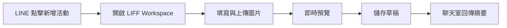
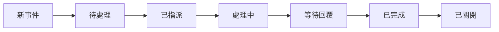
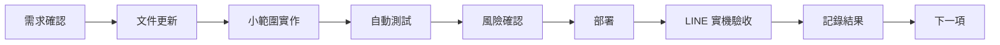

# 櫻花福委會 AI Workspace Roadmap

- 文件版本：V1.1
- 更新日期：2026-08-03
- 適用系統：櫻花福委會福利資訊整合平台
- 文件狀態：執行基線

## 1. 文件目的

本文件定義 AI Workspace 的分階段發展路線、各階段目標、交付範圍、完成條件、風險、依賴與驗收方式。

核心原則：

- 先交付可驗收、低風險功能，不為大型 Framework 延誤專案。
- 保留既有後台，AI Workspace 是 LINE OA 前台管理入口。
- 先讀取、再操作；先草稿、再正式執行。
- 高風險動作必須人工確認並留下 Audit Log。
- 每個階段均須可部署、可驗收、可回滾。
- 「已開發」「已測試」「已部署」「已驗收」必須分開標示，不得互相替代。

## 2. 產品總目標

讓福委會管理員不必熟悉複雜後台，也能在 LINE OA 中看見營運摘要、待辦與風險，並經由 Flex Dashboard 與 LIFF Workspace 完成日常工作。

> AI Workspace 不是讓管理員找功能，而是主動告訴管理員今天該處理什麼，並協助完成工作。

## 3. 現況基線與架構邊界

### 3.1 現況

- Phase 0 的主要產品、UX、架構、V1 Spec 與 Roadmap 文件已建立。
- Phase 1 已有精準關鍵字、管理員白名單及唯讀文字摘要的程式基線。
- Flex Dashboard、五個可操作入口、正式部署與 LINE 實機驗收，必須依實際證據分別標記，不能因純文字摘要可用就視為 Phase 1 全部完成。
- Phase 2 至 Phase 8 目前均屬規劃，不得描述為已上線。

### 3.2 不可跨越的系統邊界

- 母站負責員工身分驗證與點數權威資料。
- 子站負責 AI Workspace、廠商、活動、監控與管理介面。
- LINE Webhook 維持單一 reply owner，不建立第二條搶用 `replyToken` 的回覆路徑。
- Phase 1 僅允許既有 D1 的 `SELECT`，不得新增寫入、migration 或高風險操作。
- AI 只能摘要、分類、草擬與建議；核准、退件、正式推播、扣點、退款、停權與刪除均須人工確認。

### 3.3 狀態定義

| 狀態 | 定義 |
|---|---|
| 已規劃 | 文件已定義需求與驗收 |
| 已開發 | 程式已完成，但不代表測試或上線 |
| 已測試 | 指定自動或手動測試已有證據 |
| 已部署 | 指定版本已部署至目標環境 |
| 已驗收 | 管理員與非管理員情境均完成實機驗證 |

## 4. Roadmap 總覽

| 階段 | 名稱 | 主要成果 | 風險 |
|---|---|---|---|
| Phase 0 | 文件與基線 | PRD、UX Flow、Architecture、V1 Spec、Roadmap | 低 |
| Phase 1 | Flex 儀表板 | LINE 即時摘要與五個入口 | 低 |
| Phase 2 | 新增活動工作台 | LIFF 建立活動草稿與預覽 | 中 |
| Phase 3 | 訊息推播工作台 | 分眾、預覽、測試發送與排程 | 高 |
| Phase 4 | 廠商審核工作台 | AI 摘要、補件、人工核准或退件 | 中高 |
| Phase 5 | 聊天室監控 | 待處理訊息與人工確認回覆 | 中 |
| Phase 6 | AI 風險中心 | 異常聚合、證據與處理建議 | 中高 |
| Phase 7 | 主動任務中心 | 今日工作與系統事件提醒 | 中 |
| Phase 8 | 模組化與複用 | 抽取經驗證的共用核心 | 中 |

## 5. Phase 0：文件與基線建立

### 目標

先確立產品方向、操作流程、技術邊界與交付標準，避免開發期間反覆改方向。

### 交付文件

- `docs/AI_workspace_PRD.md`
- `docs/AI_workspace_UX_flow.md`
- `docs/AI_workspace_architecture.md`
- `docs/AI_workspace_V1_spec.md`
- `docs/AI_workspace_roadmap.md`
- 建議補充 `docs/AI_workspace_delivery_standard.md`

### 完成條件

- 文件名稱與引用路徑一致，PRD、Architecture 與 V1 Spec 不衝突。
- Architecture 明確定義 Webhook 單一回覆責任。
- Roadmap 定義各階段風險與驗收。
- 文件內容與現有程式狀態一致。
- 尚未開始不必要的大型重構。

### 驗收

開工前回報已讀文件、核心要求、程式差異與下一步；在確認前不得直接改程式。

## 6. Phase 1：Flex 儀表板

### 目標

管理員在 LINE OA 輸入「儀表板」或「仪表板」後，收到即時 Flex Dashboard。

### 功能範圍

- 精準辨識兩個關鍵字。
- 先驗證 `admin_uid_whitelist`，非管理員只收到無權限訊息。
- 顯示待審廠商、已上架優惠、今日核銷筆數與金額。
- 聊天室待處理數、風險事件數若尚未啟用，必須明確標示。
- 提供「新增活動、訊息推播、廠商審核、風險中心、聊天室監控」五個入口。
- 未完成入口只能顯示安全 placeholder，不得假裝已執行。

### 安全限制

- 只執行 `SELECT`。
- 不新增 migration、不修改 Admin UI、不改點數或核銷。
- 不發送正式推播、不破壞既有 Webhook。

### 完成與驗收

- 管理員收到 Flex，非管理員看不到管理資料。
- 五個入口均可點擊且回應明確。
- 查詢不拖慢 Webhook，不重複使用 `replyToken`。
- 自動測試、部署、管理員與非管理員 LINE 實機驗收均有證據。
- 記錄部署版本與回滾方式。

### 風險與時程

- 風險：Flex JSON 錯誤、資料外洩、Intent 衝突、查詢逾時、重複回覆。
- 建議時程：1 至 2 個開發工作天。

## 7. Phase 2：新增活動工作台

### 目標

由 LINE 的「新增活動」入口開啟 LIFF Workspace，建立活動草稿並預覽，不必進入傳統後台。

### V1 欄位

- 活動類型、主辦社團、標題、封面、內容、日期時間與地點。
- 報名起訖、名額、費用、報名資格與聯絡窗口。
- 點數折抵設定與是否啟用 QR 報到。
- 草稿或發布狀態。

### 流程

### 限制與驗收

- 第一階段只建立草稿，正式發布需二次人工確認。
- AI 可整理文案，不可自行發布。
- 圖片上傳 R2、session、表單驗證、錯誤恢復與 Audit Log 均須測試。
- 完成後可關閉工作台並回到 LINE 情境。
- 建議時程：3 至 5 個開發工作天。

## 8. Phase 3：訊息推播工作台

### 目標

從 LINE 完成受眾選擇、內容編輯、預覽、測試發送、排程與狀態查詢。

### 開發順序

1. 推播草稿。
2. 受眾與預估人數預覽。
3. 文字、圖片或 Flex 預覽。
4. 測試發送給管理員。
5. 建立排程。
6. 正式發送與報表。

### 安全與驗收

- 正式發送前二次確認，顯示受眾數與預估成本。
- AI 不可自行決定受眾或執行正式發送。
- 失敗可重試但不得重複發送，所有操作保留 Audit Log。
- 驗證排程時區、LINE 使用量、訊息格式與既有推播相容性。
- 建議時程：4 至 7 個開發工作天。

## 9. Phase 4：廠商審核工作台

### 目標

管理員在 LINE 查看待審廠商與完整證據，完成補件、核准或退件。

### 功能與 AI 邊界

- 顯示基本資料、優惠、文件、補件紀錄與風險提示。
- AI 可摘要缺漏、找矛盾、提醒風險及草擬補件通知。
- AI 不可自動核准、退件、停權或認定違規。

### 完成條件

- 完整清單與單筆資料可讀。
- 補件、核准與退件均需二次確認和 Audit Log。
- 廠商收到正確通知，狀態同步，非管理員不得存取。
- 建議時程：4 至 6 個開發工作天。

## 10. Phase 5：聊天室監控

### 目標

集中呈現待處理、高優先、抱怨、廠商、活動及點數核銷爭議訊息。

### 原則與驗收

- 顯示最近對話與關聯會員、廠商、活動資料。
- AI 僅提供有依據的回覆草稿，管理員修改並確認後才送出。
- 不捏造政策、優惠或退款承諾；法律、個資與爭議轉人工。
- 防止錯誤對話、重複回覆與個資外洩。
- 建議時程：5 至 8 個開發工作天。

## 11. Phase 6：AI 風險中心

### 目標

把聊天、核銷、廠商、活動及系統監控異常整理成可追蹤事件。

### 事件內容

- 標題、嚴重程度、摘要、關聯對象、證據數量。
- 建議處理方式、狀態、指派人、建立時間。

### AI 邊界與驗收

- AI 可分類、摘要、排序、聚合相似事件及草擬聯絡內容。
- AI 不得自動停權、退款、刪除、認定責任或公開回覆爭議。
- 事件可指派、變更狀態、查看證據並完整稽核。
- 建議時程：5 至 10 個開發工作天。

## 12. Phase 7：主動任務與事件中心

### 目標

主動整理待審廠商、即將截止活動、失敗推播、負面訊息、異常核銷與 Webhook 錯誤。

### 事件生命週期

### 完成條件

- 今日工作可從儀表板直接處理，同類事件可合併。
- 已完成事件不重複提醒，可設定頻率並避免訊息轟炸。
- 建議時程：5 至 8 個開發工作天。

## 13. Phase 8：模組化與複用

### 可抽取模組

- Intent Router、Identity Resolver、Permission Manager。
- Workspace Router、Flex Dashboard Builder、Popup Workspace Shell。
- API Gateway、Event Bus、Audit Log、AI Suggestion Engine。

### 不應過早抽取

- 櫻花專屬資料表、母站員工驗證、點數與審核規則。
- 特定活動欄位、Rich Menu 與 LINE OA 設定。

### 完成條件

- 至少兩個專案實際共用。
- 輸入輸出清楚、不依賴櫻花環境變數。
- 有測試、版本、升級及回滾策略。
- 抽取不影響櫻花交付。

## 14. 優先順序

| 等級 | 處理範圍 |
|---|---|
| P0 | 權限或個資漏洞、Webhook 無法回覆、點數核銷錯誤、重複推播、正式環境失效 |
| P1 | 當前交付、主要流程、驗收阻塞、按鈕無反應、Flex 顯示失敗 |
| P2 | 流程與介面改善、AI 建議、次要報表、自動摘要 |
| P3 | SaaS、多租戶、大型 Framework、跨專案事件中心與高度自動化 |

## 15. 固定交付標準

每個階段必須回報：

- 目標、已完成與未完成項目。
- 修改與新增檔案。
- 風險、權限、Webhook、資料寫入及 migration 影響。
- 實際測試結果。
- 部署狀態、環境、指令與版本。
- 回滾方式。
- 管理員與非管理員驗收步驟、預期結果與回歸結果。
- 下一步建議。

缺少驗收步驟、預期結果、部署狀態或回滾方式，不得標示完成。

## 16. 開發節奏

每次只交付一個小而完整的功能，避免同時重構多個模組而無法定位錯誤。

## 17. 近期執行順序

1. 完成 Phase 1 Flex Dashboard，驗收管理員、非管理員、五個入口與既有流程。
2. 完成 Phase 2 活動草稿 Workspace。
3. 完成 Phase 3 前半段：推播草稿、受眾預覽與測試發送；正式大量發送延後。
4. 建立 Phase 4 廠商審核 Workspace。
5. 建立 Phase 5 聊天室監控與 Phase 6 風險中心。

## 18. 成功指標

### 使用與教學

- 日常工作點擊數、進入傳統後台次數與操作時間下降。
- 新管理員學習時間、操作錯誤與詢問入口次數下降。

### 營運品質

- 廠商審核與聊天室處理時間下降。
- 風險發現更快，推播誤發率維持為零。
- 所有高風險動作均有人為確認。

### 系統穩定

- Webhook 與 Flex 成功率可量測。
- Worker 錯誤率可追蹤。
- 重複回覆與未授權資料存取皆為零。

## 19. 決策摘要

- 櫻花福委會依現有架構交付，AI Workspace 疊加其上。
- 第一階段先完成 Flex 儀表板，第二階段優先做新增活動。
- 推播分成草稿、測試與正式發送。
- AI 提供建議，但不直接執行高風險決策。
- LINE 聊天室是入口，LIFF Workspace 是複雜工作的操作介面。
- 傳統後台保留為完整管理與備援工具。
- Framework 抽取延後至主要功能穩定後。
