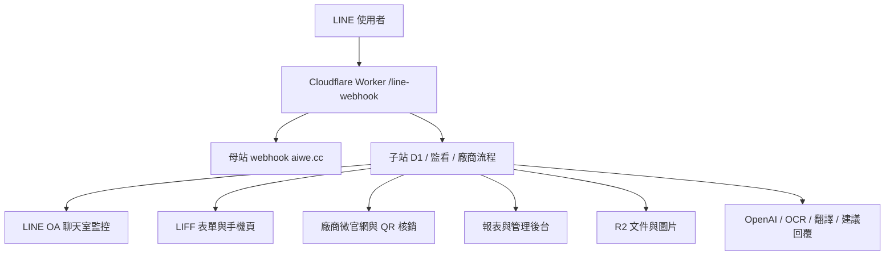

# 櫻花福委會平台 Codex 工作流與角色手冊

本文件把本專案的固定工作方式整理成可執行規則。目標不是增加文件量，而是避免後續修改偏離「LINE OA + LIFF + D1 + 廠商微官網 + QR 核銷 + 福委會報表」這條主線。

## 一、專案定位

櫻花福委會福利資訊整合平台是一套以 LINE OA 為入口的福利、特約店家、廠商經營與福委會管理系統。

核心使用者：

- 員工：綁定身分、查福利、找店家、使用員工優惠、詢問 AI。
- 外籍員工：透過 AI 自動翻譯取得福利與店家資訊。
- 廠商：從 LINE 聊天室送件、補件、上傳菜單/DM/服務項目、建置微官網、掃碼核銷。
- 福委會：審核廠商與優惠、監看輿情、追蹤營運數據、產出管理報表。
- 總管理處：查看全站內容、成效、風險、資料留存。

## 二、固定架構



既有重要路徑：

| 類型 | 路徑 |
| --- | --- |
| Worker | `https://sakura-welfare-platform.fangwl591021.workers.dev` |
| 管理後台 | `/sakura-admin` |
| LINE Webhook | `/line-webhook` |
| 子站 Webhook | `/line-child-webhook` |
| 監控檢測 | `/hub-test` |
| 廠商申請 | `/vendor-apply` |
| 廠商專區 | `/vendor-showcase` |
| 店家微官網 | `/vendor-store` |
| 店家核銷 | `/vendor-pos`, `/vendor-redeem` |
| 聊天監控 | `/line-oa-monitor` |

## 三、角色化工作準則

### 1. 福委會委員視角

福委會需要的是可治理、可追蹤、可驗收，而不是只有漂亮畫面。

必備能力：

- 廠商註冊審核：看得到完整申請表、文件、缺件、補件說明與審核歷程。
- 優惠審核：確認廠商提供的優惠符合員工利益，不低於對外訪客條件。
- 輿情監看：看到抱怨、稱讚、品質問題、待處理、已處理。
- 管理報表：看導入率、使用率、核銷、廠商成效、異常與到期文件。

驗收重點：

- 每個待辦項目都能回到原始資料。
- 核准、退回、停權、隱藏都有狀態提示。
- 不要只顯示統計數字，必須可下鑽查看清單。

### 2. LINE OA 維運視角

LINE OA 是主入口，不是附屬功能。

必備能力：

- 雙 webhook 正常轉發。
- 關鍵字規則可管理，例如：`廠商申請`、`廠商專區`、`分享給好友`、`每日打卡取點`、`到店打卡`、`附近店家`。
- 監看頁同時看到使用者訊息與管理員回覆。
- AI 建議只輔助，不自動冒充客服回覆。

驗收重點：

- 輸入關鍵字一次就有反應，不需要輸入第二次。
- 回覆成功後，後台對話紀錄也要出現我方回覆。
- 需要 LIFF 身分的流程不可要求使用者手填 LINE UID。

### 3. 廠商經營視角

廠商要能用手機完成大部分事情。

必備能力：

- 從聊天室叫出申請與補件表單。
- 已送件者再次進入時看到既有資料與審核狀態，不能空白重填。
- 通過審核後可叫出 `廠商專區`。
- 可上傳菜單、DM、服務項目，由 AI/OCR 生成展示內容。
- 可編輯店家微官網。
- 可開啟 QR 掃描器進行消費核銷。

驗收重點：

- 防重複送件。
- 補件原因清楚。
- 上傳有進度百分比，完成有通知。
- 店家能找到自己的頁面與操作入口。

### 4. 員工與用戶視角

員工要快速取得優惠；非員工也可能加好友，成為 CRM 用戶。

必備能力：

- 員工透過母站或 LINE 綁定身分。
- QR 折抵能分辨員工與訪客。
- 用戶列表保存所有加好友者，逐步形成 CRM 欄位。
- 外籍員工可以用母語詢問，AI 自動翻譯與回答。

驗收重點：

- 員工價不可被非員工截圖濫用。
- QR 有效時間短，且由後端驗證。
- CRM 不只是「非員工會員」，而是所有 LINE 用戶資料池。

### 5. 財務與核銷視角

核銷資料未來會影響廠商成效、點數與稽核。

必備欄位：

- 廠商、店點、操作員。
- LINE user id、員工/訪客身分。
- 原價、折扣、實付、折抵額。
- QR token、建立時間、核銷時間、過期狀態。
- 點數類型與母站 API 回應。

驗收重點：

- 5 分鐘 QR 失效不難，應做成後端 token 到期驗證。
- 不可只在前端倒數，否則截圖仍可被利用。
- 每筆核銷都能追溯。

### 6. UI/UX 視角

管理後台要高密度、清楚、少裝飾。

準則：

- 左側導航可收合但要容易打開。
- 廠商與 LINE OA 位置依實際操作頻率排列。
- 註冊審核清單採傳統表格或 CRM 列表，一行一家，點入看完整內容。
- 手機端必須像 App，不是縮小版桌面。
- 不必要的上方大標題、裝飾卡片、空白區要移除。

## 四、主要流程驗收表

| 流程 | 驗收項目 |
| --- | --- |
| 廠商申請 | LINE 輸入一次即回覆 LIFF 按鈕；已送件者按鈕一鎖住，按鈕二進入編輯/狀態。 |
| 廠商補件 | 文件上傳為 file input；補件原因與審核結果可見；重新進入表單有原資料。 |
| 廠商核准 | 後台可查看完整申請內容後核准；核准後廠商可開啟廠商專區。 |
| 廠商專區 | 可上傳菜單、DM、服務項目；生成微官網展示內容；顯示進度與完成通知。 |
| 店家微官網 | 手機版展示 hero、店介、地址、電話、LINE、優惠、點數入口、分享與商品/DM。 |
| QR 核銷 | 員工端出示真 QR；店家端可掃描；token 短效；核銷後寫 D1。 |
| LINE 監看 | 使用者與管理員回覆都寫入同一對話紀錄；同步按鈕有效。 |
| 分眾推播 | 可依標籤/受眾篩選，發送官方格式或系統客製 Flex 格式。 |
| 附近店家 | 使用者傳位置後回覆附近店家輪播卡；需有照片、店名、地址、電話。 |
| 報表 | 支援導入會員、平台使用、優惠核銷、廠商合作、異常申訴、到期提醒與匯出。 |

## 五、每次修改後的自我檢測

1. 後端工程師：路由是否 200、JSON 是否有效、D1 是否正確寫入。
2. UI 專家：畫面是否清楚、按鈕是否能點、手機是否能操作。
3. LINE OA 維運：關鍵字是否一次觸發、回覆是否入監控、LIFF 是否抓身份。
4. 廠商顧問：廠商是否知道下一步，不會重複送件或找不到店家。
5. 財務稽核：核銷、防弊、點數、金額欄位是否可追溯。
6. 福委會委員：是否能審核、查詢、匯出、追蹤成效。

## 六、部署與檢查

建議順序：

```powershell
node --check src/index.js
npx.cmd wrangler d1 migrations apply sakura-welfare-db --remote
npx.cmd wrangler deploy
curl.exe -s https://sakura-welfare-platform.fangwl591021.workers.dev/hub-test
```

若只改文件，不需要部署 Worker。

