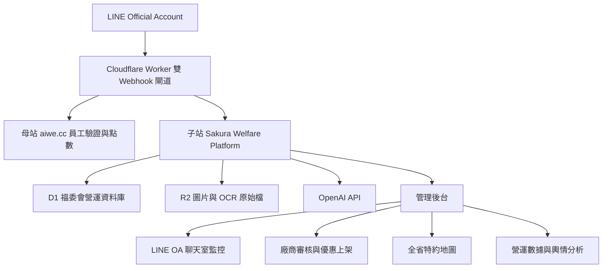

# Sakura Welfare Platform Architecture

## 委員視角的目標

我們希望這個平台不是單純公告特約店，而是福委會、員工、廠商三方都能持續使用的福利營運系統。

福委會要能掌握福利是否真的被看見、被使用、被稱讚或被抱怨；員工要能快速找到自己可用的優惠；廠商要能自己維護商品與優惠，但所有上架內容必須通過審核，並且不得提供低於員工價的遊客折扣。

## 整體架構

## 母站與子站分工

母站負責身份與既有點數資產，子站負責福委會業務流程。

母站：
- 員工工號加生日四碼驗證。
- LINE user id 與會員身份綁定。
- 點數新增與查詢 API。
- 保留既有會員主資料。

子站：
- LINE webhook 子站接收與監控。
- 廠商註冊、核准、資料維護。
- 商品與優惠上架審核。
- AI OCR 菜單/商品資料轉換。
- 全省特約店家地圖與分類索引。
- QR 折抵紀錄與營運統計。
- LINE OA 聊天室監控、抱怨、稱讚、風險訊息標記。

## LINE OA 與雙 Webhook

目前 LINE Webhook 應設定為：

`https://sakura-welfare-platform.fangwl591021.workers.dev/line-webhook`

Worker 收到 LINE 事件後做三件事：

1. 驗證 LINE signature。
2. 轉發母站 webhook：`https://aiwe.cc/index.php/line_login/9111/`。
3. 子站寫入 D1，形成聊天室 thread/message 與輿情紀錄。

這樣母站既有登入與點數流程可以保留，子站也能建立自己的營運監控與管理後台。

## 核心資料模型

### LINE 監控

- `line_threads`：每一個 LINE 用戶或群組對話。
- `line_messages`：每一則 LINE 訊息。
- `line_webhook_events`：舊版事件分析與 AI 分類相容表。
- `line_webhook_intake_logs`：webhook 診斷紀錄。

### 福委會營運

- `welfare_vendors`：特約廠商主檔。
- `welfare_vendor_locations`：分店、地址、縣市、Google Maps URL。
- `welfare_offers`：廠商上架的商品、服務、優惠。
- `welfare_members`：員工、廠商、福委會、訪客身份。
- `welfare_redemptions`：QR 折抵與消費紀錄。
- `welfare_knowledge_assets`：員工手冊、福利規則、廠商資料等知識庫。

## 廠商上架流程

1. 廠商註冊。
2. 福委會或總管理處審核廠商資格。
3. 廠商上傳照片、菜單或既有 DM。
4. AI OCR 轉成商品與優惠草稿。
5. 廠商確認內容後送審。
6. 福委會審核優惠是否符合員工利益。
7. 通過後上架到 LINE OA 與特約地圖。

福委會不干涉廠商經營，但要把關三件事：

- 是否真的有員工優惠。
- 是否有不當文字、過期價格或不清楚條款。
- 遊客價不得低於員工價。

## QR 折抵與身份價格

QR Code 掃碼時，系統必須知道使用者身份：

- 員工：顯示員工折扣。
- 訪客：顯示一般優惠或不折扣。
- 廠商：顯示核銷與營運介面。
- 福委會：顯示監看與稽核資料。

範例：原價 100 元，員工 8 折，實付 80 元。

系統需保存：

- 原價。
- 員工價或訪客價。
- 實付金額。
- 折抵金額。
- 廠商、分店、商品、時間。
- 日、週、月營運統計。

## 全省特約地圖

因為櫻花門市、員工與特約店分布在全台與離島，地圖不應只以廠區為中心。

建議採兩層入口：

1. LINE Flex Message 縣市入口：
   - 北北基、桃竹苗、中彰投、雲嘉南、高屏、宜花東、離島。
   - 可沿用使用者提供的 giga bubble 圖片矩陣模式。
2. Web 地圖：
   - 縣市、分類、員工優惠、即將到期、本月強檔。
   - 不做 LBS 自動定位，但可讓使用者手動選縣市。

## AI 功能

AI 在平台中扮演輔助管理員，不直接替福委會做最後決策。

必要功能：

- OCR 廠商菜單、DM、商品照。
- 自動產生商品標題、優惠摘要與多語翻譯。
- LINE OA 訊息分類：抱怨、稱讚、建議、廠商支援、風險。
- 產生客服建議回覆，但不自動發送。
- 檢查廠商優惠內容是否含糊、過期或違反員工價規則。
- 知識庫問答，來源包含員工手冊、報價單、簡報與福委會規則。

## 多國語系

繁中為主資料，印尼文與泰文由 AI 自動翻譯。

翻譯流程：

1. 廠商或管理員建立繁中內容。
2. AI 產生印尼文與泰文。
3. 系統標記為機器翻譯。
4. 重要公告可由管理員人工覆核。

## 後台功能大項

- 總覽：待審、投訴、熱門優惠、使用率。
- LINE OA 專區：聊天室監控、Rich Menu、Flex Message、分眾推播、Webhook 狀態。
- 廠商管理：註冊審核、店家資料、優惠商品、OCR 上架。
- 員工與會員：員工綁定、訪客管理、身份查詢。
- 特約地圖：縣市入口、分類管理、店家地圖。
- QR 核銷：掃碼折抵、核銷紀錄、異常檢查。
- 數據報表：日營運、週營運、月營運、廠商成效。
- 知識庫：文件上傳、AI 摘要、多語翻譯。
- 系統設定：母站 API、OpenAI API、LINE Token、權限。

## 目前第一階段落地重點

第一階段先完成可展示且可運作的骨架：

- 雙 webhook 接通。
- D1 寫入 LINE threads/messages。
- TravelKeeper 版 LINE OA 監控頁接到 Sakura Worker。
- D1 建立福委會核心資料表。
- Rich Menu 編輯器保留，後續再整理為獨立模組。

第二階段再補：

- 廠商註冊審核。
- AI OCR 上架。
- QR 折抵。
- 地圖入口。
- 報表與知識庫上傳。
