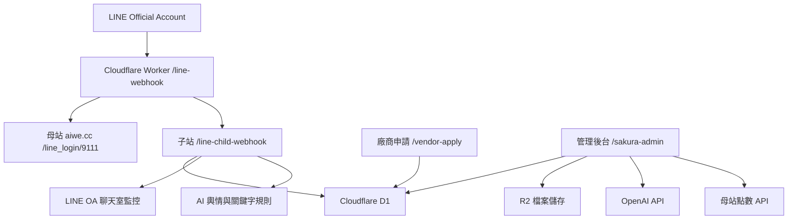

# 櫻花福委會福利資訊整合平台規格書與驗收項目表

文件日期：2026-05-12  
專案客戶：台灣櫻花股份有限公司  
系統名稱：櫻花福委會福利資訊整合平台  
主要入口：LINE Official Account、Cloudflare Worker 後台、廠商申請頁  
目前 Worker：`https://sakura-welfare-platform.fangwl591021.workers.dev/`

---

## 1. 專案定位

本平台不是單純的「特約店公告頁」，而是福委會、員工、廠商與非員工用戶共同使用的福利營運平台。

核心目標：

1. 員工能透過 LINE 快速找到福利公告、特約廠商、優惠活動、點數與折抵資訊。
2. 廠商能自行註冊、維護店家資料、上架商品與優惠，但必須審核通過後才公開。
3. 福委會能監看優惠使用狀況、廠商品質、員工回饋、抱怨與建議。
4. 系統需支援外籍員工，以 AI 自動翻譯與多語問答協助繁中、印尼文、泰文使用者。
5. 會員身份、員工驗證與點數權威資料由母站掌握；子站負責福委會業務流程、廠商與內容營運。

平台設計原則：

- 福委會不干涉廠商日常經營，但審核優惠揭露、價格規則、廠商品質與員工權益。
- 廠商不得提供比員工價更低的訪客折扣。
- 所有 LINE 好友都應進入 CRM 名單，未來可由註冊、問卷、打卡、推薦活動逐步補齊資料。
- 所有重要操作需留存紀錄，包含審核、上架、推播、折抵、點數、客服處理與 AI 建議。

---

## 2. 專案範圍

### 2.1 本期包含

- LINE OA 雙 Webhook 閘道。
- LINE OA 總覽與健康檢測。
- LINE 聊天室監控與 AI 輿情分類。
- LINE 關鍵字規則表。
- Rich Menu 圖文選單編輯與部署。
- Flex Message 模板中心。
- LINE 分眾推播。
- 員工名冊註冊綁定與母站驗證串接。
- 用戶 CRM 列表。
- 廠商註冊申請表。
- 廠商審核與資料維護。
- 商品與優惠上架審核。
- AI OCR 上架助手。
- QR Code 消費折抵與身份判斷。
- 母站點數 API 查詢與新增異動。
- 全省特約店地圖入口。
- 特約醫療院所獨立分類。
- 知識庫上傳與 AI 回答。
- 多語 AI 自動翻譯。
- 後台基礎儀表板與營運報表。

### 2.2 本期不包含

- LBS 即時定位服務。
- 育兒福利與心理防護網內容。
- 母站既有會員系統重構。
- 廠商金流結算。
- 發票開立與會計總帳系統。
- 真正的電商購物車與付款流程。

---

## 3. 系統角色

| 角色 | 說明 | 權限重點 |
| --- | --- | --- |
| 員工 | 台灣櫻花員工，透過工號與生日四碼驗證 | 查看員工價、使用 QR 折抵、點數、福利資訊、問答 |
| 外籍員工 | 印尼籍、泰籍或其他語言員工 | 以多語介面與 AI 翻譯查詢福利 |
| 非員工用戶 | 加入 LINE OA 的一般好友 | 可瀏覽公開資訊、訪客價、活動內容；不得取得員工價 |
| 廠商 | 特約店家或合作單位 | 送件註冊、維護店家、上架優惠、查看自身營運數據 |
| 福委會委員 | 平台主要管理者 | 審核廠商、審核優惠、監看客服、管理內容 |
| 總管理處 | 全站管理與稽核 | 查看全部資料、分類、報表、操作紀錄 |
| 系統管理員 | 技術維運 | Webhook、API、D1、R2、LINE Token、OpenAI Key 管理 |

---

## 4. 系統架構



### 4.1 母站責任

母站：`https://aiwe.cc/index.php/line_login/9111/`

負責：

- 員工身份驗證。
- 員工名冊權威資料。
- LINE_user_id 與會員對應。
- 點數新增、扣點、查詢。
- 既有會員登入與母站業務流程。

### 4.2 子站責任

子站：`https://sakura-welfare-platform.fangwl591021.workers.dev/`

負責：

- 福委會管理後台。
- LINE OA 事件監控與 D1 留存。
- 廠商註冊、審核、上架、資料維護。
- 優惠審核、QR 折抵、地圖入口。
- Flex Message、Rich Menu、分眾推播。
- AI OCR、AI 輿情、AI 翻譯、知識庫。

---

## 5. LINE OA 與 Webhook 規格

### 5.1 Webhook 設定

LINE Developers Webhook URL：

```text
https://sakura-welfare-platform.fangwl591021.workers.dev/line-webhook
```

Worker 收到 LINE 事件後：

1. 驗證 `x-line-signature`。
2. 將原始 body 轉發至母站 webhook。
3. 同步寫入子站 D1 或轉入 `/line-child-webhook`。
4. 建立 LINE thread、message、intake log。
5. 進行初步 AI 分類與關鍵字規則判斷。

### 5.2 雙 Webhook 分工

| 流程 | 母站 | 子站 |
| --- | --- | --- |
| 員工登入/綁定 | 是 | 呼叫或讀取結果 |
| 點數讀寫 | 是 | 透過 API 串接 |
| LINE 訊息監控 | 可保留既有流程 | 是 |
| AI 輿情分類 | 否 | 是 |
| 廠商上架 | 否 | 是 |
| 關鍵字活動 | 部分點數由母站處理 | 子站設定規則與觸發 |

### 5.3 LINE OA 總覽

LINE OA 總覽需提供：

- Webhook 狀態。
- LINE Channel Secret 是否設定。
- LINE Channel Access Token 是否設定。
- LINE Bot Profile 是否可讀取。
- OpenAI API Key 是否設定。
- D1 是否可寫入。
- 最新 LINE 事件。
- 聊天室數量。
- 待處理訊息。
- 抱怨、稱讚、高風險、廠商支援分類統計。
- 快速入口：聊天室監控、關鍵字規則、分眾推播、Rich Menu、Flex Message。

---

## 6. 會員、員工驗證與 CRM

### 6.1 員工驗證

員工驗證採：

```text
員工工號 + 生日四碼 MMDD
```

驗證用途：

- 初次 LINE 綁定。
- 顯示員工專屬優惠。
- 使用員工價 QR 折抵。
- 查詢個人點數與福利。
- 進入敏感福利資訊區段。

驗證權威來源：

- 母站或母站串接的員工名冊。
- 子站不得自行判定正式員工身份，只可保存驗證結果、快取狀態與操作紀錄。

### 6.2 用戶 CRM

原「非員工會員」需改為「用戶列表 / CRM」。

所有加入 LINE OA 的好友都應建立 CRM 資料：

| 欄位 | 說明 |
| --- | --- |
| LINE User ID | 主要識別值 |
| LINE 顯示名稱 | 從 LINE Profile API 補抓 |
| 頭像 | 從 LINE Profile API 補抓 |
| 身份 | 員工、訪客、廠商、委員、未知 |
| 員工工號 | 綁定後補齊 |
| 姓名 | 註冊或活動填寫後補齊 |
| 手機 | 活動、問卷或廠商聯絡補齊 |
| Email | 活動、問卷或廠商聯絡補齊 |
| 標籤 | 分眾推播與 CRM 分群 |
| 推薦人 | 分享好友活動帶入 |
| 最近互動 | 最新 LINE 訊息、點擊、打卡、折抵 |
| 備註 | 管理員內部備註 |

---

## 7. 廠商註冊與審核

### 7.1 廠商申請入口

廠商申請頁：

```text
https://sakura-welfare-platform.fangwl591021.workers.dev/vendor-apply
```

申請表需採檔案上傳，不可要求廠商自行填寫檔案 URL。

### 7.2 廠商申請表欄位

#### 公司登記

- 店家/品牌名稱。
- 公司登記名稱。
- 統一編號。
- 負責人。
- 發票抬頭。
- 登記地址。
- 分類：食、衣、住、行、育、樂、醫療、其他。
- 標籤。

#### 聯絡與帳號

- 聯絡人。
- 電話。
- Email。
- 聯絡人 LINE ID。
- 廠商 LINE OA。
- 送件 LINE User ID。

#### 證照、保險與合約

- 營業登記或證照檔案上傳。
- 食品業者登錄字號。
- 食品業者登錄文件上傳。
- 保險證號。
- 保險文件上傳。
- 合約起日。
- 合約迄日。

#### 對外資訊與優惠政策

- 官方網站。
- Facebook。
- Logo 圖片檔或 URL。
- 封面圖。
- 優惠政策。
- 員工優惠承諾。
- 訪客價不得低於員工價同意。

#### AI 初審與委員審核

- AI 初審摘要。
- 文件缺漏提示。
- 優惠政策是否清楚。
- 是否可能違反員工價規則。
- 委員備註。
- 審核狀態：待審、核准、退回、停權。
- 合作狀態：新合作、啟用、續約中、到期、停用。

### 7.3 廠商管理清單

廠商管理需採傳統 CRM 表格方式：

- 一行一家。
- 新申請依建立時間往上排。
- 點擊後進入完整申請表內容。
- 可搜尋廠商、統編、聯絡人、LINE、狀態。
- 可快速操作：核准、退回、停權、編輯。

---

## 8. 廠商上架、優惠與 OCR

### 8.1 上架原則

- 廠商可自行上架商品、服務、活動、菜單、DM。
- 廠商只能看到自己的上架資料與營運數據。
- 總管理處與福委會可查看全部上架內容。
- 所有商品與優惠需審核通過後才公開。
- 福委會不干涉商品經營，但審核優惠揭露、員工價、訪客價與使用規則。

### 8.2 商品與優惠欄位

- 廠商。
- 商品/服務名稱。
- 分類。
- 商品圖片。
- 原價。
- 員工價。
- 訪客價。
- 折扣率。
- 使用限制。
- 可使用地點。
- 是否啟用 QR 折抵。
- 上架期間。
- 審核狀態。
- 審核備註。

### 8.3 價格規則

系統必須檢查：

```text
訪客價 >= 員工價
```

若訪客價低於員工價，系統不得送審或不得核准。

### 8.4 AI OCR 上架助手

廠商可：

- 拍照上傳菜單。
- 上傳既有 DM。
- 上傳價目表。
- 貼上商品資料。

AI OCR 需產生可編輯草稿：

- 商品名稱。
- 原價。
- 員工價。
- 訪客價。
- 優惠說明。
- 使用限制。
- 可能缺漏欄位。
- 審核風險提醒。

AI 產生內容不得直接公開，需由廠商確認並送審。

---

## 9. QR Code 消費折抵

### 9.1 身份判斷

掃碼時需判斷：

- 員工。
- 非員工訪客。
- 廠商操作員。
- 管理員或測試帳號。

### 9.2 折抵規則

範例：

```text
原價 100 元
員工價 80 元
訪客價 100 元
員工實付 80 元
```

系統需保證：

- 員工取得員工價。
- 訪客不得取得比員工更低的折扣。
- 廠商不得私自變更違規價格。
- 折抵紀錄需可追溯。

### 9.3 折抵紀錄欄位

- LINE User ID。
- 身份類型。
- 廠商。
- 分店。
- 優惠。
- 原價。
- 員工價。
- 訪客價。
- 實付金額。
- 折抵金額。
- QR Code ID。
- 核銷時間。
- 核銷操作員。
- 狀態。

---

## 10. 母站點數 API 串接

### 10.1 新增點數 API

```http
POST https://aiwe.cc/index.php/wp-json/wetw-point/v1/insert-user-point
```

必要欄位：

- `api_key`
- `LINE_user_id`
- `shop_id`
- `event_name`
- `event_content`
- `point_type`
- `get_point`

點數類型：

- `system_point`：點數。
- `gift_money`：購物金。

### 10.2 查詢點數 API

```http
POST https://aiwe.cc/index.php/wp-json/wetw-point/v1/query-user-point-list
```

查詢條件至少需提供：

- `LINE_user_id`
- 或 `shop_id`

可選：

- `point_type`
- `date_start`
- `date_end`
- `page`
- `per_page`

### 10.3 點數情境

- 每日打卡取點。
- 到店打卡取點。
- 活動參與贈點。
- 推薦好友贈點。
- 消費折抵扣點。

子站只做串接與紀錄，點數權威餘額由母站管理。

---

## 11. LINE 關鍵字規則

LINE OA 專區需提供關鍵字表，讓管理者設定觸發內容。

### 11.1 預設關鍵字

| 關鍵字 | 動作 | 說明 |
| --- | --- | --- |
| 分享給好友 | 推薦連結 | 帶有自己 UID 作為推薦碼，接受邀約者登記在推薦人名下 |
| 每日打卡取點 | 點數流程 | 每日簽到贈點，需冷卻或每日限制 |
| 到店打卡 | 店家 QR 點數 | 到店家掃碼後贈點 |

### 11.2 規則欄位

- 關鍵字。
- 比對方式：完全符合、包含、正則。
- 動作類型：回覆文字、回覆 Flex、開啟 URL、推薦連結、每日打卡、到店打卡、客製流程。
- 是否需員工身份。
- 是否需店家 QR。
- 點數類型。
- 點數異動。
- 冷卻秒數。
- Flex 版型。
- 目標 URL / LIFF 路徑。
- 啟用狀態。
- 優先序。

---

## 12. LINE 聊天室監控與 AI 輿情

### 12.1 監控目的

因平台同時面對員工、廠商與一般用戶，必須監看：

- 廠商品質抱怨。
- 優惠不能使用。
- 店家服務態度。
- 稱讚與推薦。
- 廠商上架問題。
- 員工福利問題。
- 高風險或需通報事件。

### 12.2 介面需求

- 左側聊天室列表。
- 中間訊息記錄。
- 右側 AI 助理。
- LINE OA 管理欄位可收合。
- AI 助理欄位可收合。
- 聊天室需顯示真實名稱與頭像。
- 可標籤、備註、處理狀態。
- 可送出正式 LINE 回覆。
- AI 建議僅供管理員參考，不自動回覆。

### 12.3 AI 分類

分類：

- 一般訊息。
- 抱怨。
- 稱讚。
- 建議。
- 廠商支援。
- 高風險。
- 待追蹤。

AI 需輸出：

- 摘要。
- 判斷理由。
- 建議回覆。
- 優先等級。
- 是否需通知委員。

---

## 13. Flex Message 與 Rich Menu

### 13.1 Rich Menu

Rich Menu 編輯器需支援：

- 上傳底圖。
- 劃定點擊區域。
- 支援 URI、message、postback、richmenuswitch。
- 產出 JSON。
- 部署至 LINE。
- 檔案庫儲存與重新載入。

### 13.2 Rich Menu 身分與語系綁定規則

本平台需支援依 LINE 使用者身份與語系套用不同 Rich Menu，避免員工、廠商、管理者或訪客回到錯誤首頁。

#### 套用對象

| 對象 | 條件 | 建議 alias ID | 說明 |
| --- | --- | --- | --- |
| 未綁定訪客 | 加入好友但尚未完成員工或廠商綁定 | `guest_zh` | 顯示註冊、員工綁定、廠商申請與公開活動入口 |
| 繁中員工 | 工號 + 生日四碼綁定成功，語系繁中 | `employee_zh` | 顯示員工福利、特約店、點數與常見問題 |
| 印尼文員工 | 員工綁定成功，語系印尼文 | `indo-menu` | 顯示印尼文福利入口與 AI 問答 |
| 待審廠商 | 廠商送件但尚未核准或需補件 | `vendor_pending` | 顯示申請表、補件、審核結果查詢 |
| 已核准廠商 | 廠商審核通過 | `vendor_approved` | 顯示廠商專區、上傳菜單/DM、核銷與微官網維護 |
| 管理者/福委會 | UID 白名單具管理角色 | `admin_menu` | 顯示後台、監控、審核、報表與推播入口 |

#### 判斷優先序

1. 管理者/福委會。
2. 已核准廠商。
3. 待審或補件廠商。
4. 已綁定員工，依語系套用。
5. 未綁定訪客。

#### 標註說明

- `alias ID` 用於管理辨識與 richmenuswitch 頁面切換。
- 正式綁定特定 LINE 使用者時，仍需填入 LINE 回傳的 `richMenuId`，由後端身份事件呼叫 LINE Rich Menu link API。
- 觸發時機包含員工綁定成功、語系變更、廠商審核狀態改變、UID 白名單角色變更、手動重新同步。
- 後台需提供「Rich Menu 身分綁定規則」頁面，可新增、編輯、停用、刪除規則，並顯示現有 Rich Menu 專案參考。

### 13.3 Flex Message 模板中心

工具入口保留：

- 自由版 Flex。
- 網址擷取器。

自由版 Flex 內可建立不同功能型版型，例如：

- 標準資訊。
- 影音版。
- 商品目錄。
- 多頁輪播。

必要功能：

- 建立專案。
- 我的檔案夾 / 專案列表。
- 開啟、編輯、儲存、另存。
- 即時預覽。
- 匯出 JSON。
- 分享好友。
- 分眾推播。

### 13.4 LIFF 分享好友

LIFF ID：

```text
2009117474-pwyW1R4u
```

分享好友必須使用：

```javascript
liff.shareTargetPicker([flexMsg])
```

禁止手動把 Flex JSON 塞進 URL 參數。  
PC 版需依賴 LINE SDK 的 POST 轉 OTT 機制開啟通訊錄。

分享錯誤處理：

- 若 `not allowed`，執行 `liff.logout()` 並重新登入。
- 若使用者取消，顯示取消訊息。
- 不得顯示「成功」但實際未送出。

---

## 14. 分眾推播

### 14.1 受眾篩選

推播需能依 CRM 資料篩選：

- 身份：員工、訪客、廠商、未知。
- 綁定狀態。
- 標籤。
- 最近互動。
- 活動參與。
- 廠商關聯。
- 地區。
- 推薦來源。

### 14.2 推播內容

需支援：

- 官方文字。
- 官方圖片。
- 系統客製 Flex 版型。
- 貼上 Flex JSON。
- 付費或限制內容推播。

### 14.3 推播紀錄

需紀錄：

- 推播名稱。
- 推播時間。
- 操作者。
- 受眾條件。
- 受眾數。
- 成功數。
- 失敗數。
- LINE 回應狀態。
- 使用的模板或內容。

---

## 15. 全省特約店地圖

### 15.1 地圖定位

特約店分布可能遍及全台與離島，不只廠區周邊。因此地圖需以縣市分類、區域分類與店家清單為主。

本期不做 LBS 即時定位。

### 15.2 分類

分類：

- 食。
- 衣。
- 住。
- 行。
- 育。
- 樂。
- 醫療。
- 其他。

區域：

- 北部。
- 中部。
- 南部。
- 東部。
- 離島。

特約醫療院所需：

- 保留在原縣市分類中。
- 另有獨立「特約醫療院所」篩選入口。

### 15.3 LINE Flex 入口

可採：

- 上方影片或主視覺。
- 下方縣市圖片格。
- 點擊縣市後送出指定文字。
- Webhook 回傳該縣市特約店列表。

---

## 16. 知識庫與 AI 問答

### 16.1 知識庫類型

- 文字。
- 網址。
- 檔案。

檔案需使用檔案上傳，不應要求使用者自行提供 URL。

可上傳：

- PDF。
- Word。
- Excel。
- CSV。
- 圖片。
- 員工手冊。
- 福利規則。
- 廠商合約或 DM。

### 16.2 AI 問答

AI 需依知識庫回答：

- 員工福利規則。
- 特約優惠使用方式。
- QR 折抵 SOP。
- 點數取得方式。
- 廠商上架流程。
- 外籍員工多語詢問。

### 16.3 多語

支援：

- 繁體中文。
- 印尼文。
- 泰文。

流程：

1. 使用者輸入原語言問題。
2. AI 判斷語言。
3. 以繁中知識庫查詢。
4. 回覆翻譯成使用者語言。
5. 保留原文與翻譯紀錄。

---

## 17. 後台資訊架構

左側後台建議排序：

1. 總覽。
2. 廠商管理。
3. LINE OA 專區。
4. 會員與點數。
5. 內容與 AI。
6. 報表與稽核。

### 17.1 總覽

- 營運儀表板。
- 待辦與通知中心。
- 分眾推播排程。

### 17.2 廠商管理

- 廠商註冊審核。
- 特約店家資料。
- 商品與優惠上架。
- AI OCR 上架助手。
- 優惠審核待辦。
- 全省特約店地圖。

### 17.3 LINE OA 專區

- LINE OA 總覽。
- Rich Menu 設定。
- Flex Message 模板。
- 全省地圖入口。
- LINE 分眾推播。
- 聊天室訊息紀錄。
- Webhook 轉發狀態。
- 關鍵字規則表。

### 17.4 會員與點數

- 員工名冊綁定。
- 用戶列表 / CRM。
- 母站 API 串接。
- QR Code 折抵紀錄。
- 點數讀寫紀錄。

### 17.5 內容與 AI

- 多語與 AI 詢問。
- 知識庫。
- AI 輿情分類。
- OCR 任務。
- 翻譯任務。

---

## 18. 資料表建議

| 資料表 | 用途 |
| --- | --- |
| `line_threads` | LINE 對話 thread |
| `line_messages` | LINE 訊息明細 |
| `line_webhook_events` | LINE 事件與 AI 初步分類 |
| `line_webhook_intake_logs` | Webhook 診斷紀錄 |
| `line_keyword_rules` | 關鍵字觸發規則 |
| `line_keyword_hits` | 關鍵字觸發紀錄 |
| `welfare_members` | 員工、用戶、廠商、委員 CRM |
| `welfare_vendors` | 廠商主檔 |
| `welfare_vendor_locations` | 廠商地點與分店 |
| `welfare_offers` | 商品與優惠 |
| `welfare_redemptions` | QR 折抵紀錄 |
| `welfare_knowledge_assets` | 知識庫 |
| `flex_templates` | Flex 版型專案 |
| `line_push_campaigns` | 分眾推播活動 |
| `line_push_logs` | 推播明細 |

---

## 19. 權限與安全

安全要求：

- LINE Webhook 必須驗證 signature。
- API Key 不得出現在前端。
- LINE Channel Access Token 不得出現在前端。
- OpenAI API Key 不得出現在前端。
- 點數 API Key 必須放在 Worker secrets。
- 檔案上傳需限制大小與類型。
- 廠商只能讀寫自己的資料。
- 總管理處才可查看全站資料。
- 員工敏感福利內容需驗證後顯示。
- 操作紀錄需留存操作者與時間。

---

## 20. 會議決策待確認

| 議題 | 建議決策 | 需客戶確認 |
| --- | --- | --- |
| 員工名冊來源 | 母站或 HR 匯入為權威來源 | 是 |
| 工號格式 | 依台灣櫻花實際工號格式 | 是 |
| 生日四碼 | MMDD，不含年份 | 是 |
| 外籍員工語言 | 先支援印尼文、泰文 | 是 |
| 點數名稱 | 點數、購物金是否都啟用 | 是 |
| 推薦好友贈點 | 推薦人與被推薦人是否都給點 | 是 |
| 每日打卡點數 | 每日點數與冷卻規則 | 是 |
| 到店打卡點數 | 是否需 GPS 或只用店家 QR | 是 |
| 特約醫療院所 | 是否獨立審核流程 | 是 |
| 廠商文件 | 必填文件清單與例外規則 | 是 |
| 優惠審核 SLA | 幾天內完成審核 | 是 |
| 分眾推播權限 | 哪些角色可正式推播 | 是 |
| AI 回覆 | 是否允許半自動送出或僅建議 | 是 |

---

# 驗收項目表

| 編號 | 模組 | 驗收項目 | 測試方式 | 通過標準 | 優先 |
| --- | --- | --- | --- | --- | --- |
| A-001 | Webhook | LINE Webhook URL 可驗證 | LINE Developers Verify | 顯示 Success | P0 |
| A-002 | Webhook | Worker 驗證 LINE signature | 送出有效/無效簽章 | 有效通過，無效 403 | P0 |
| A-003 | Webhook | 母站 webhook 轉發 | LINE 發送訊息 | 母站流程仍可收到事件 | P0 |
| A-004 | Webhook | 子站 D1 寫入事件 | LINE 發送測試訊息 | D1 有 intake log 與 message | P0 |
| A-005 | LINE OA 總覽 | 顯示 D1、Token、OpenAI 狀態 | 開啟總覽 | 狀態正確且可刷新 | P0 |
| A-006 | LINE OA 總覽 | 顯示最新事件 | 發送 LINE 訊息 | 總覽出現最新訊息 | P1 |
| A-007 | 聊天室監控 | 聊天室列表顯示訊息 | LINE 留言 | 左欄出現 thread | P0 |
| A-008 | 聊天室監控 | 顯示 LINE 名稱與頭像 | Profile API 可讀時 | 非 placeholder 名稱與頭像 | P1 |
| A-009 | 聊天室監控 | AI 分類抱怨 | 輸入「不能用優惠」 | 分類為抱怨或待處理 | P1 |
| A-010 | 聊天室監控 | 管理員備註可儲存 | 輸入備註 | 重整後仍存在 | P1 |
| A-011 | 聊天室監控 | 正式回覆送出 | 管理員送出文字 | LINE 用戶收到訊息，後台留紀錄 | P0 |
| A-012 | 關鍵字 | 分享給好友觸發 | LINE 輸入關鍵字 | 產生帶 UID 推薦連結 | P0 |
| A-013 | 關鍵字 | 每日打卡取點 | LINE 輸入關鍵字 | 呼叫點數 API 並有冷卻限制 | P0 |
| A-014 | 關鍵字 | 到店打卡 | 掃店家 QR | 依店家與身份贈點 | P0 |
| A-015 | 關鍵字 | 規則可新增/停用 | 後台操作 | 規則立即影響觸發 | P1 |
| A-016 | 員工驗證 | 工號 + MMDD 驗證 | 輸入正確資料 | 綁定 LINE User ID | P0 |
| A-017 | 員工驗證 | 錯誤資料不得綁定 | 輸入錯誤資料 | 顯示失敗且不寫入綁定 | P0 |
| A-018 | CRM | LINE 好友進入 CRM | 新用戶傳訊 | CRM 出現 LINE User ID | P0 |
| A-019 | CRM | CRM 欄位可編輯 | 編輯電話/標籤 | 儲存並可搜尋 | P1 |
| A-020 | CRM | 推薦關係可記錄 | 用推薦連結加入 | 被推薦人掛在推薦人名下 | P1 |
| A-021 | 廠商申請 | 申請頁可開啟 | 開啟 `/vendor-apply` | 表單正常顯示 | P0 |
| A-022 | 廠商申請 | 檔案上傳 | 上傳證照/保險 | 檔案進 R2，後台可查看 | P0 |
| A-023 | 廠商申請 | 必填欄位驗證 | 空白送出 | 顯示缺漏，不建立無效資料 | P0 |
| A-024 | 廠商審核 | 清單一行一家 | 新增多筆申請 | 依時間排序，點入明細 | P1 |
| A-025 | 廠商審核 | 核准/退回/停權 | 後台操作 | 狀態更新且留審核紀錄 | P0 |
| A-026 | 廠商資料 | 編輯申請表 | 修改聯絡資料 | 儲存後列表同步更新 | P1 |
| A-027 | 商品上架 | 廠商建立優惠 | 建立商品 | 進入待審狀態 | P0 |
| A-028 | 商品上架 | 訪客價不得低於員工價 | 輸入違規價格 | 系統阻擋送審或核准 | P0 |
| A-029 | OCR | 菜單 OCR 產生草稿 | 上傳菜單 | 產出品項、價格、限制 | P1 |
| A-030 | OCR | AI 草稿需人工確認 | OCR 後檢查 | 不會直接公開 | P0 |
| A-031 | 優惠審核 | 審核通過才上架 | 待審優惠 | 未核准前前台不可見 | P0 |
| A-032 | QR 折抵 | 員工掃碼取得員工價 | 員工身份掃 QR | 實付為員工價 | P0 |
| A-033 | QR 折抵 | 訪客掃碼不得取得員工價 | 訪客身份掃 QR | 顯示訪客價或公開價 | P0 |
| A-034 | QR 折抵 | 折抵紀錄完整 | 完成核銷 | 原價、實付、身份、店家皆有 | P0 |
| A-035 | 點數 | 新增點數 API 串接 | 呼叫母站 API | 回傳 success 並留紀錄 | P0 |
| A-036 | 點數 | 查詢點數 API 串接 | 查詢 LINE User ID | 顯示列表與分頁 | P1 |
| A-037 | 地圖 | 縣市分類 | 選縣市 | 顯示該縣市店家 | P1 |
| A-038 | 地圖 | 醫療獨立分類 | 選特約醫療院所 | 顯示醫療院所且仍保留縣市分類 | P1 |
| A-039 | 地圖 | 無 LBS 依賴 | 不授權定位 | 仍可查分類與店家 | P1 |
| A-040 | Rich Menu | 可上傳底圖與劃區 | 建立選單 | JSON 合法 | P1 |
| A-041 | Rich Menu | 可部署至 LINE | 按部署 | LINE 官方帳號選單更新 | P0 |
| A-061 | Rich Menu 身分綁定 | 可建立身份與語系套用規則 | 開啟 Rich Menu 身分綁定頁新增規則 | 規則寫入 D1 且列表顯示優先序與標註說明 | P0 |
| A-062 | Rich Menu 身分綁定 | 預設規則覆蓋訪客、員工、廠商、管理者 | 按重建預設規則 | 出現 `guest_zh`、`employee_zh`、`employee_id`、`employee_th`、`vendor_pending`、`vendor_approved`、`admin_menu` | P0 |
| A-042 | Flex | 自由版可建立專案 | 新增專案 | 專案出現在我的檔案夾 | P0 |
| A-043 | Flex | 專案可儲存與開啟 | 儲存後重整 | 可重新開啟編輯 | P0 |
| A-044 | Flex | 分享好友喚起通訊錄 | 按分享好友 | LIFF shareTargetPicker 開啟通訊錄 | P0 |
| A-045 | Flex | 分享不得空包彈 | 分享後檢查 | 收件好友收到 Flex | P0 |
| A-046 | Flex | 網址擷取器 | 輸入 URL | 產生可編輯 Flex 草稿 | P1 |
| A-047 | 分眾推播 | 依標籤篩選受眾 | 選標籤 | 受眾數正確 | P0 |
| A-048 | 分眾推播 | 發送官方文字 | 送測試名單 | 用戶收到文字 | P0 |
| A-049 | 分眾推播 | 發送客製 Flex | 選 Flex 模板 | 用戶收到 Flex | P0 |
| A-050 | 分眾推播 | 推播紀錄 | 完成推播 | 成功/失敗數可查 | P1 |
| A-051 | 知識庫 | 文字知識可儲存 | 新增文字 | AI 可引用 | P1 |
| A-052 | 知識庫 | 網址知識可儲存 | 新增 URL | 顯示 URL 與摘要 | P1 |
| A-053 | 知識庫 | 檔案上傳 | 上傳 PDF | 檔案進 R2 並建立索引 | P0 |
| A-054 | 多語 AI | 印尼文詢問 | 輸入印尼文 | 回覆印尼文且內容正確 | P1 |
| A-055 | 多語 AI | 泰文詢問 | 輸入泰文 | 回覆泰文且內容正確 | P1 |
| A-056 | 權限 | API Key 不外露 | 檢查前端原始碼 | 不含敏感 Key | P0 |
| A-057 | 權限 | 廠商只看自己資料 | 廠商帳號登入 | 不可看其他廠商 | P0 |
| A-058 | 權限 | 員工價需驗證 | 未綁定用戶查看 | 不顯示員工專屬價 | P0 |
| A-059 | 報表 | 日週月營運統計 | 建立折抵資料 | 報表數字正確 | P2 |
| A-060 | 稽核 | 操作留痕 | 審核/推播/折抵 | 可查操作者與時間 | P1 |

---

## 21. 明日會議建議流程

1. 先確認平台定位：LINE OA 福利營運平台，不是單純公告頁。
2. 確認母站與子站分工，尤其員工驗證與點數。
3. 確認廠商註冊表必填文件與審核規則。
4. 確認優惠價格規則與 QR 折抵流程。
5. 確認全省地圖分類與醫療院所獨立入口。
6. 確認 LINE 關鍵字活動：分享好友、每日打卡、到店打卡。
7. 確認 Flex / Rich Menu / 分眾推播管理方式。
8. 確認 AI 用途與不能自動回覆的邊界。
9. 逐項過驗收表，將 P0 作為第一階段交付。


