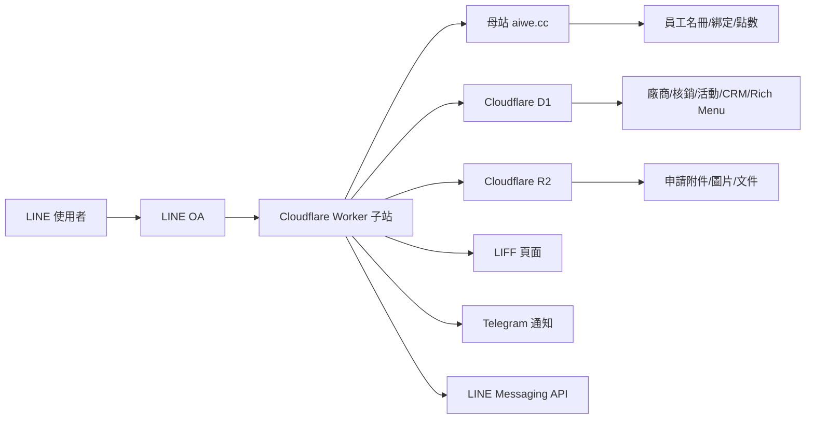

# 櫻花福委會福利資訊整合平台教學使用手冊

版本：v1.0  
更新日期：2026-07-30  
適用對象：福委會管理者、LINE OA 維運人員、特約廠商、客服與驗收人員

## 1. 系統定位

本系統是建置在 LINE OA 與 Cloudflare Worker 上的福委會福利資訊整合平台。核心目標不是單純公告，而是把「身份綁定、圖文選單分流、特約廠商申請、廠商審核、店家微官網、消費核銷、會員紀錄、活動簽到與報表」串成一個可管理的流程。

系統分為母站與子站：

| 區塊 | 責任 |
| --- | --- |
| 母站 | 員工名冊、員工驗證、既有會員與點數資料 |
| 子站 | LINE OA 子流程、廠商申請審核、D1 資料、R2 檔案、LIFF 頁面、微官網、核銷、報表 |

操作原則：

1. 員工身份由母站驗證，子站接收同步結果。
2. 點數由母站讀寫，子站不自建點數權威。
3. 廠商後台以帳密為主，LINE / LIFF 為輔。
4. AI 只做輔助建議與 OCR，不自動核准敏感流程。
5. 所有會影響員工看到內容的廠商資料變更，都應回到審核流程。

## 2. 主要角色

| 角色 | 說明 | 主要入口 |
| --- | --- | --- |
| 一般訪客 | LINE 好友、尚未完成員工綁定者 | LINE OA、公開 LIFF 頁 |
| 員工 | 已完成母站工號與生日驗證者 | 員工 Rich Menu、會員專區 |
| 外籍員工 | 已綁定且使用印尼文或泰文體驗者 | 對應語系 Rich Menu |
| 待審廠商 | 已送件但尚未核准或補件中 | 廠商申請、廠商專區 |
| 已核准廠商 | 可維護店家資料與執行核銷者 | 廠商專區、核銷工作台 |
| 福委會管理者 | 審核、監控、報表與系統設定 | 管理後台 |

## 3. 系統架構總覽



## 4. 常用入口

正式入口應以後台與 LINE OA 實際設定為準。以下為目前專案常用路徑：

| 功能 | 網址 |
| --- | --- |
| 管理後台 | `https://sakura-welfare-platform.fangwl591021.workers.dev/sakura-admin` |
| 廠商申請 | `https://sakura-welfare-platform.fangwl591021.workers.dev/vendor-apply` |
| 廠商帳密登入 | `https://sakura-welfare-platform.fangwl591021.workers.dev/vendor-login` |
| 特約店家列表 | `https://sakura-welfare-platform.fangwl591021.workers.dev/partner-stores` |
| 特約醫療院所 | `https://sakura-welfare-platform.fangwl591021.workers.dev/medical-providers` |
| 會員消費紀錄 | `https://liff.line.me/2009117474-pwyW1R4u/member-redemptions` |
| LINE OA 監控 | `https://sakura-welfare-platform.fangwl591021.workers.dev/line-oa-monitor` |
| Webhook 狀態 | `https://sakura-welfare-platform.fangwl591021.workers.dev/hub-test` |

語系原則：

| 類型 | 繁中 | 印尼文 | 泰文 |
| --- | --- | --- | --- |
| 員工 Rich Menu | `twmem-menu` | `indo-menu` | `taimem-menu` |
| 特約店家 | 中文頁 | 印尼文頁 | 泰文頁 |
| 消費查詢 | 中文頁 | 印尼文頁 | 泰文頁 |

## 5. LINE OA 關鍵字

LINE OA 是使用者的主要操作入口。關鍵字分為母站負責與子站負責。

| 關鍵字 | 責任系統 | 用途 |
| --- | --- | --- |
| 會員分享 / 分享給好友 | 母站為主，子站支援紀錄 | 產生帶推薦碼的分享入口 |
| 櫻花報到 | 母站 | 員工報到、綁定或名冊同步來源 |
| 每日打卡取點 | 母站 | 每日簽到與點數流程 |
| 到店打卡 | 母站/子站依規則 | 到店掃碼贈點或紀錄 |
| 廠商申請 | 子站 | 開啟廠商送件流程 |
| 廠商專區 | 子站 | 顯示廠商操作入口、審核狀態與核銷工作台 |
| 廠商登入 | 子站 | 顯示廠商帳密登入入口 |
| 特約店家 | 子站 | 依身份與語系切換或開啟特約店家入口 |

注意：母站已有的關鍵字不能被子站覆蓋。子站可記錄與輔助，但不能搶用 replyToken 破壞母站既有回覆。

## 6. 員工操作流程

### 6.1 員工綁定

1. 員工從 LINE OA 點選會員綁定或輸入母站指定關鍵字。
2. 母站驗證員工資料，例如工號與生日。
3. 母站完成綁定後，子站同步 LINE User ID、員工狀態、報到時間與必要欄位。
4. 子站依語系與身份套用 Rich Menu。

驗收標準：

- CRM 使用者列表顯示 `員工`、`bound`。
- 顯示對應 Rich Menu，例如 `twmem-menu`、`indo-menu`、`taimem-menu`。
- 使用者不應再被導回未綁定首頁。

### 6.2 會員專區

會員專區用於查詢個人資料，不應顯示內部 UID 或技術來源文字。

主要頁籤：

| 頁籤 | 功能 |
| --- | --- |
| 消費紀錄 | 查詢特約店家核銷、實付與折抵紀錄 |
| 活動紀錄 | 查詢活動報名或簽到紀錄 |

消費紀錄應顯示：

- 店家名稱
- 消費時間
- 消費金額
- 實付金額
- 折抵金額
- 備註，未填則不顯示

不應顯示：

- LINE UID
- QR token
- `母站個人 QR`
- `店家現場消費` 這類內部技術文字

## 7. 廠商申請流程

廠商申請分為三大區，互不干擾：

1. 廠商基本資料
2. 證照區
3. 優惠內容區

### 7.1 廠商基本資料

必要資料：

- 店家/品牌名稱
- 公司登記名稱
- 統一編號
- 地址
- 聯絡人
- 電話
- Email
- 廠商自訂登入帳號
- 廠商自訂登入密碼
- 自有網站、社群或線上購物車連結

注意：

- 大型廠商可能由系統代填，不一定由廠商自行註冊。
- 廠商帳密是主要登入方式，不應誤用管理員帳密。
- LINE UID 只能由 LINE/LIFF 流程取得，不要求廠商自己填。

### 7.2 證照區

證照與文件應使用檔案上傳，不應只提供 URL 欄位。

常見文件：

- 營業登記或證照檔案
- 食品業者登錄字號與證明
- 保險證明與保險文件
- 合約或合作文件

### 7.3 優惠內容區

廠商需提供員工專屬優惠，例如：

- 員工價
- 折扣
- QR Code 核銷優惠
- 訪客不得低於員工優惠的規則說明

系統端標籤由管理者標記，廠商只能看，不能自行修改。

### 7.4 防重送規則

系統應依以下資料避免重複送件：

- 廠商帳號
- LINE User ID
- 電話
- 統一編號
- 店名與聯絡資料

已送件者再次進入申請流程時，不應看到空白表單；應進入「編輯/修改資料」或「審核結果」。

## 8. 廠商審核與補件

福委會管理者在後台審核廠商資料。

審核時應能看到：

- 公司登記資料
- 聯絡與帳號資料
- 證照與保險文件
- 優惠內容
- 店家地點與分類
- 系統或 AI 初審提醒

審核結果：

| 狀態 | 說明 |
| --- | --- |
| 待審 | 已送件，等待福委會確認 |
| 已核准 | 可展示、可進廠商專區 |
| 退回 | 需補件或修改 |
| 停權 | 暫停展示與核銷 |
| 隱藏 | 後台保留，但不出現在一般清單 |

補件流程：

1. 管理者填寫退回原因。
2. 廠商從 LINE OA `廠商專區` 或審核結果頁查看原因。
3. 廠商補上文件或修改資料。
4. 系統重新進入審核清單。

Telegram 通知：

- 新申請
- 補件完成
- 店家公開資料修改申請
- 審核通過或退回
- 重要異常

Telegram 參數應放在「系統參數設定」，不寫死在程式或前端。

## 9. 廠商專區

廠商在 LINE OA 輸入 `廠商專區` 後，系統依 LINE UID 對應已核准或待審廠商。

建議入口精簡為三組：

| 區塊 | 用途 |
| --- | --- |
| 廠商操作中心 | 修改店家資料、查看審核結果 |
| 店家頁面 | 編輯微官網、查看公開店家頁 |
| 核銷與營運 | 核銷工作台、消費折抵紀錄、今日營運 |

狀態顏色：

| 顏色 | 意義 |
| --- | --- |
| 綠色 | 通過、可用、已開通 |
| 紅色 | 異常、缺件、未開通 |
| 黃色 | 待確認、待審、尚未完成 |
| 灰色 | 未填寫、未申請、不適用 |

## 10. 店家微官網

店家微官網是給員工與訪客看的公開店家頁，不是廠商後台。

可呈現：

- 店家名稱
- Logo
- 封面圖片
- 營業說明
- 地址
- 電話
- LINE
- 優惠活動
- 分享名片
- 自有網站、社群或線上購物車連結

不應在消費者公開頁顯示：

- 廠商登入
- 核銷工作台
- 管理按鈕
- 內部審核資訊

公開列表點「店家網站」時，應連到該店家的微官網。

## 11. 店家核銷工作台

店家核銷工作台只給已核准廠商使用，而且只能看到自己的店家資料。

### 11.1 登入規則

主登入方式：

- 廠商帳號
- 廠商密碼

LINE / LIFF 用途：

- 開啟掃碼器
- 取得必要的 LINE WebView 能力
- 從 `廠商專區` 直接帶 portal token 進入

重要規則：

- 不以 LINE Login 作為唯一登入方式。
- 從 LINE 點進 POS 時，應記住登入狀態或使用有效 portal token。
- 不應每次都要求重新輸入帳密。

### 11.2 核銷流程

1. 店家登入核銷工作台。
2. 輸入消費金額。
3. 填寫備註，可空白。
4. 開啟掃碼器掃描會員 QR。
5. 系統帶出會員名稱與歷史消費金額總計。
6. 系統依後台折扣規則計算實付與折抵。
7. 店家確認核銷。
8. 顯示成功提示，並播放提示音。
9. 寫入店家與會員消費紀錄。

欄位命名：

| 舊稱 | 正確名稱 |
| --- | --- |
| 原價 | 消費金額 |
| QR 內容 / 短效碼 | 應放在備註下方或掃碼後自動帶入 |

不應顯示：

- 技術來源文字
- 不必要的 QR 原始內容
- 他店資料

## 12. 特約店家與醫療院所

特約店家與醫療院所都是員工可查詢的福利資訊，但分類不同。

### 12.1 特約店家

篩選條件：

- 分類，例如食、衣、住、行、育、樂、生活服務、其他
- 地區
- 營業狀態
- 關鍵字搜尋

手機畫面上，分類、地區、營業狀態應左右並排，避免佔用太多高度。

### 12.2 醫療院所

醫療院所除可在分類中呈現，也應獨立成醫療專區。

建議區域：

- 北部
- 中部
- 南部
- 花東
- 離島

店家卡片應可點開地址、電話與地圖，並提供進入店家微官網的按鈕。

## 13. Rich Menu 操作

Rich Menu 控制不同身份看到的 LINE 圖文選單。

### 13.1 目前主要 alias

| 身份/語系 | alias |
| --- | --- |
| 未綁定訪客首頁 | `guest_zh` |
| 繁中員工 | `twmem-menu` |
| 印尼文員工 | `indo-menu` |
| 泰文員工 | `taimem-menu` |

### 13.2 預設首頁規則

只有 `guest_zh` 可以設為訪客預設首頁。新增或更新其他選單時，不應改變全域預設首頁。

員工、廠商、管理者的選單應由身份綁定規則套用，不由全域預設控制。

### 13.3 圖片更新規則

更換 Rich Menu 圖片時，既有熱區座標不得消失。圖片替換只應更新底圖，保留原本區域與動作設定。

### 13.4 切換規則

圖文選單內部切換應使用 LINE `richmenuswitch` 動作與 `switch:<alias>` data。不要用一般關鍵字假裝切換。

若切換慢或沒有反應，需檢查：

- D1 專案 alias
- LINE alias 是否指向正確 richMenuId
- postback data 是否為 `switch:<alias>`
- Rich Menu 切換時間紀錄

## 14. LINE OA 監控

LINE OA 監控頁用於查看用戶、員工、廠商與訪客訊息。

用途：

- 看客服互動
- 標記抱怨、稱讚、建議、客訴
- 產生 AI 建議回覆
- 追蹤廠商品質反映
- 確認 webhook 是否有收到訊息

注意：

- AI 建議只供管理員參考，不自動回覆。
- 管理員手動回覆後，回覆內容也應寫入聊天紀錄，否則無法完整追蹤互動。

## 15. 活動與簽到

活動模組用於福委會活動管理，不贈點。

功能：

1. 自訂行事曆新增活動。
2. 活動可設定可見對象：
   - 全體可看
   - 一般訪客
   - 廠區員工
   - 公司幹部
3. 產出活動 QR Code。
4. 使用者掃碼完成簽到。
5. 後台統計出席名單。
6. 會員專區顯示活動紀錄。

行事曆應支援：

- 上月 / 下月切換
- 月曆檢視
- 活動清單
- 開合提示

## 16. CRM 與員工同步

CRM 使用者列表是所有 LINE 好友與互動者的母表。

資料會逐步由以下行為補齊：

- LINE 加好友
- 員工綁定
- 問卷或活動
- 消費核銷
- 廠商申請
- 客服互動

員工綁定同步需顯示：

- LINE 名稱
- 身份別
- 綁定狀態
- 對應圖文選單
- 員工工號
- 生日四碼或驗證必要欄位，依個資規則限制顯示
- 最後互動時間

## 17. 報表

福委會管理報表應支援以下目的：

1. 掌握平台導入成效。
2. 了解員工使用狀況。
3. 評估特約廠商合作效益。
4. 作為福利規劃、活動優化與續約依據。

建議報表：

| 類別 | 指標 |
| --- | --- |
| 導入與會員 | 員工綁定率、已綁定/未綁定、新進離職異動、會員/訪客分析 |
| 平台使用 | MAU、優惠瀏覽排行、推播開封率、點擊率、分類使用熱度 |
| 優惠核銷 | 核銷次數、核銷金額、會員/訪客使用分析、熱門/低使用優惠 |
| 廠商合作 | 店家成效排行、各店核銷表現、異常與申訴、合約到期提醒 |

報表功能需支援：

- 期間篩選
- 地區篩選
- 福利類別篩選
- 店家篩選
- 圖表與明細表切換
- 月、季、年趨勢
- CSV / Excel 匯出
- 權限控管與歷史留存

## 18. 管理後台功能地圖

| 區塊 | 功能 |
| --- | --- |
| 營運儀表板 | 綜合營運指標、待辦提醒、風險狀態 |
| 待辦與通知中心 | 需處理的申請、補件、異常、活動與系統提醒 |
| 廠商管理 | 註冊審核、店家資料、優惠上架、醫療/地圖、核銷與成效 |
| LINE OA 專區 | 總覽、Rich Menu、身份綁定、Flex 模板、關鍵字、分眾推播、聊天室監控 |
| 會員與點數 | 員工名冊綁定、CRM、母站 API 串接、消費紀錄 |
| 內容與 AI | 知識庫、AI 問答、多語翻譯、輿情監控 |
| 活動管理 | 行事曆、活動 QR、簽到名單 |
| 報表 | 平台、廠商、優惠、會員、活動報表 |
| 系統設定 | Telegram、UID 白名單、登入權限、Webhook 狀態 |

## 19. 驗收檢查表

| 流程 | 驗收重點 |
| --- | --- |
| 員工綁定 | 母站完成綁定後，子站 CRM 顯示 bound，並套用正確語系 Rich Menu |
| 訪客首頁 | 未綁定使用者只看到訪客首頁，不被員工或廠商選單覆蓋 |
| 廠商申請 | 首次送件成功、重進不空白、不重複送件、可看審核結果 |
| 廠商補件 | 補件上傳成功，後台可查看文件與原因 |
| 廠商核准 | 核准後 LINE `廠商專區` 能進入廠商操作入口 |
| 微官網 | 消費者頁不出現廠商登入，店家網站按鈕連到微官網 |
| POS 核銷 | 只顯示本店資料，可掃碼，金額折扣正確，有成功提示與聲音 |
| 會員紀錄 | 會員能查詢消費紀錄與活動紀錄，不顯示 UID 與內部字串 |
| Rich Menu | 更新圖片保留熱區，非 `guest_zh` 不改訪客預設首頁 |
| Webhook | 母站與子站轉發正常，母站關鍵字不被覆蓋 |
| 報表 | 可依期間、地區、分類、店家篩選並匯出 |

## 20. 維運注意事項

1. 修改 Worker 前先讀專案文件與對應 runbook。
2. 修改 `src/index.js` 後一定執行：

```powershell
cd "D:\OneDrive\文件\New project 5"
node --check src\index.js
npm.cmd run predeploy:welfare
```

3. 部署只能使用：

```powershell
cd "D:\OneDrive\文件\New project 5"
npx.cmd wrangler deploy -c wrangler.sakura-welfare.toml
```

4. 不使用裸指令 `wrangler deploy`。
5. 不在前端或 Git 中放 secret、token、API key。
6. LINE 內測試需重新產生新 Flex 卡片，不要拿舊卡片判斷。
7. D1 schema、計數與列表要同步確認，避免「數字有、列表沒有」。
8. LIFF Redirect URI 必須與 LINE Developers 後台一致。

